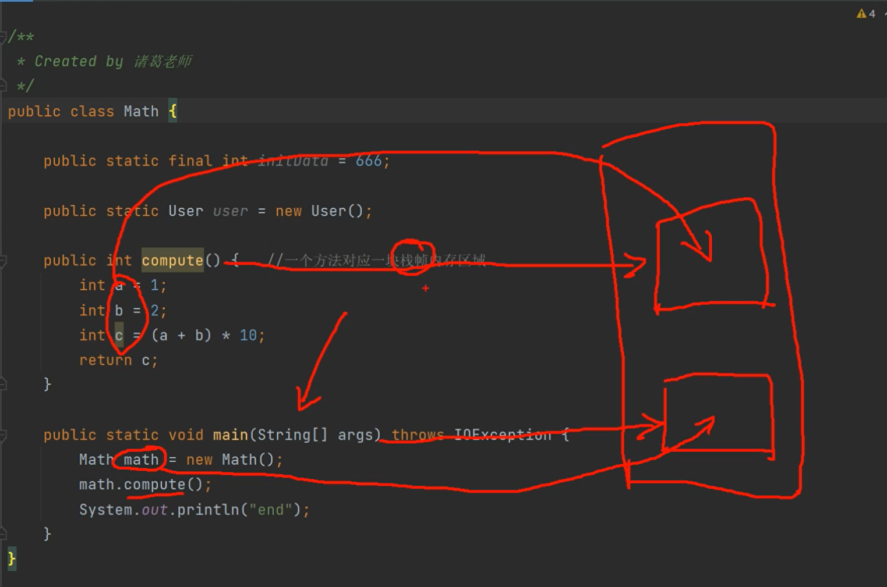
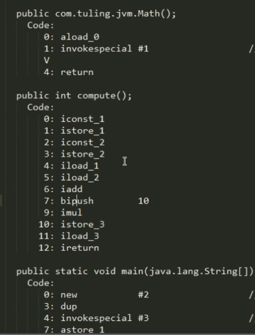
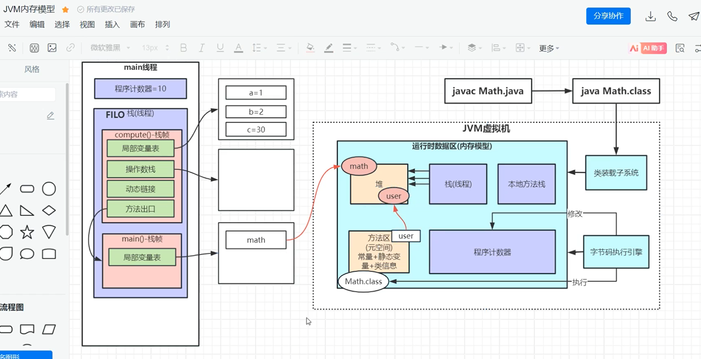
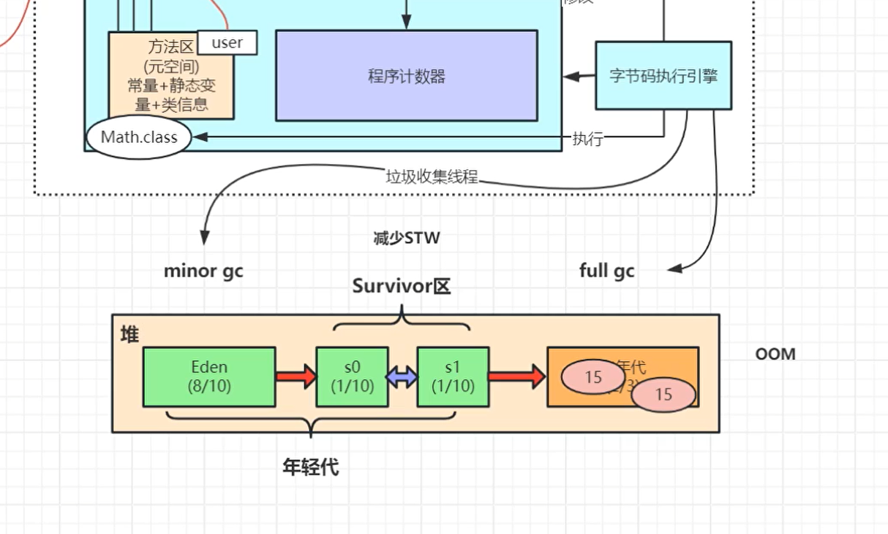
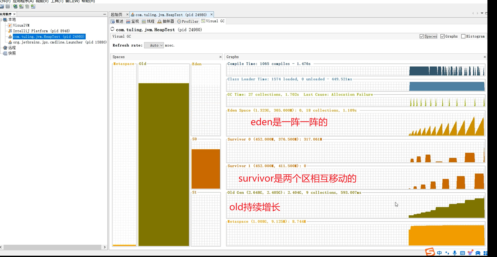
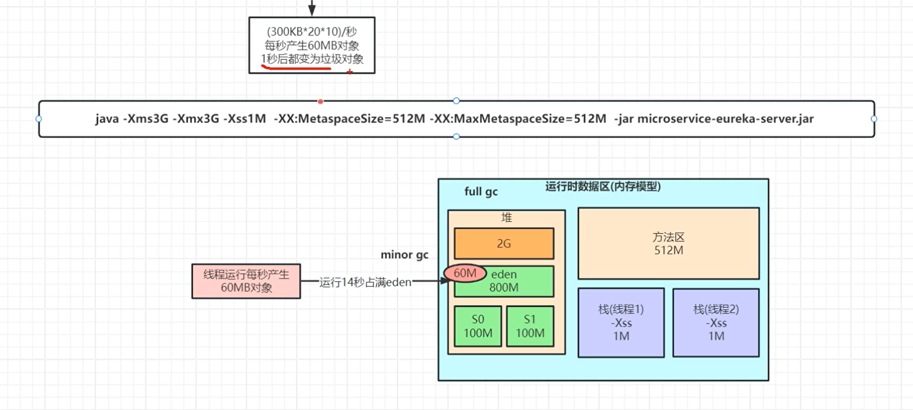
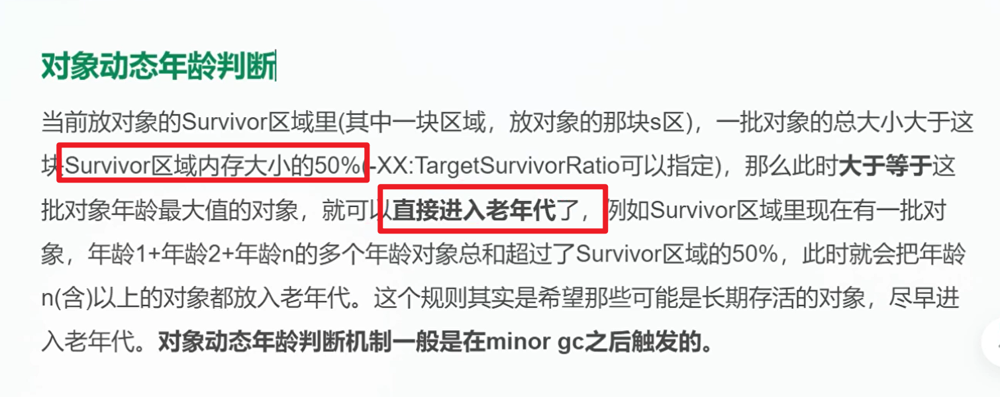
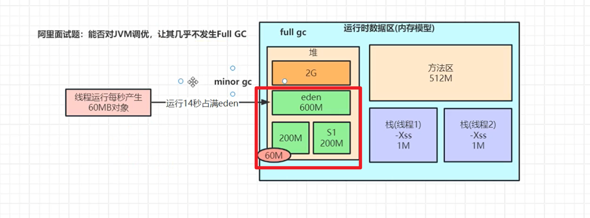
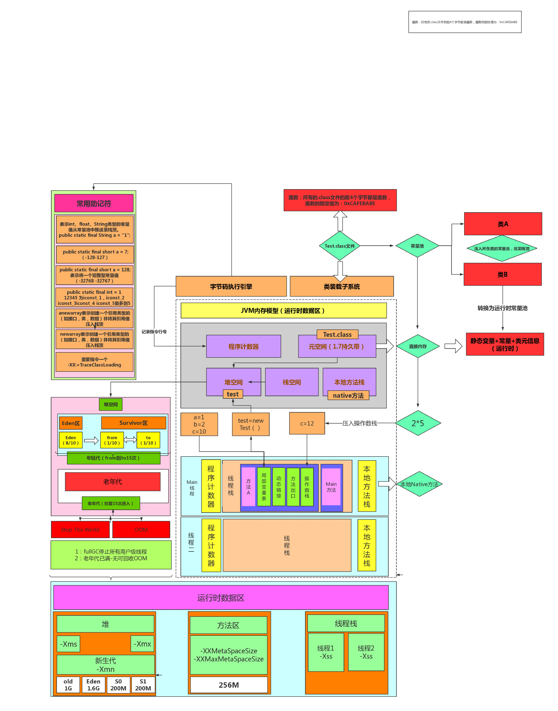

# 讲透JVM虚拟机面试核心点与性能优化点

回放地址：[https://ab.shkt.online/c/hZfdbPFA2](https://ab.shkt.online/c/hZfdbPFA2)

[https://1500024016.vod-qcloud.com/43a7c11dvodtranscq1500024016/e0b8de511397757891813184109/v.f1446751.mp4](https://1500024016.vod-qcloud.com/43a7c11dvodtranscq1500024016/e0b8de511397757891813184109/v.f1446751.mp4)
资料：[https://pan.baidu.com/s/14iGw4_y-dGrT6pNxfw81RA](https://pan.baidu.com/s/14iGw4_y-dGrT6pNxfw81RA) 提取码: imxx

## JVM 内存简易图

  
    

        math.txt反汇编文件" >
        
javap -c Math.class>math.txt反汇编文件

    

[//]: # (![e68cf09bf73356f8c18e3b67516061fe.png]&#40;e68cf09bf73356f8c18e3b67516061fe.png&#41;)

[//]: # (![javap -c Math.class>math.txt反汇编文件]&#40;image.png&#41;)

**堆内存**：new math()，new user()放在堆内存里，静态变量uesr放在元空间里，

**栈内存**：main方法，compute放在栈里，

**局部变量**：compute里面的变量放在栈内存给compute的区域里的，采用先近后出，

**操作数栈**：javap -c Math.class>math.txt里面临时数的存放地址，取出来计算后放在局部变量里

**动态链接**：c++实现，把符号引用转变为直接引用,java里的方法名变量名都叫做符号，compute方法编译成字节码文件里，compute方法其实叫做符号引用，（这里我理解的很懵，大概就是找compute在内存里面存放的入口地址）

**方法出口**：compute方法在main方法中执行完的地方

**程序计数器**：记录每次代码运行的下一行的行号，不是java代码的，是javap -c Math.class>math.txt的反汇编文件的行号，

**本地方法栈**：private final native void wait0(),`wait0` 方法声明为 `native`，表示它是一个**本地方法**，其实现由底层的**本地代码**（通常是用 C 或 C++ 编写的）来提供，而不是直接用 Java 编写。`native` 关键字告诉 JVM，这个方法的具体实现不在 Java 代码中，而是在本地库（通常是与 JVM 一起编译的共享库）中。
**元空间**：常量(final)+静态变量(static)+类信息

**紫色(栈内存，本地方法栈，程序计数器)是每个线程私享的，黄色(堆内存，元空间)是所有线程共享的**

## jvm垃圾回收

年轻代1/3 vs 老年代2/3

年轻代： eden 8/10 vs survivor(S0 1/10 ,S1 1/10)

### 垃圾增长图

### jvm调优 模拟案例 1

假设有一个电商系统，每秒60m的对象进来，1秒后都会变垃圾对象，

分析：14秒后占领eden区域，会触发minor gc，此时60m 大于 survivor中s0的一版大小，则直接进入老年代

解决： 调整survivor区的大小，这也不会让垃圾过大直接进入老年代，而是在survivor 进行minor gc 回收

### jvm调优 怎么解决大内存

不要全部回收，回收一部分， 这也就不会停顿太久 比如g1中的设置最大停顿时间，

## 线上调优工具

阿里巴巴开源的 **arthas**

**java -jar arthas-boot.jar** 运行

使用 **dashboard** 查看状态

使用 **thread -b** 查看阻塞线程

使用 **thread [id号]** 查看具体线程问题

## jvm内存模型图

