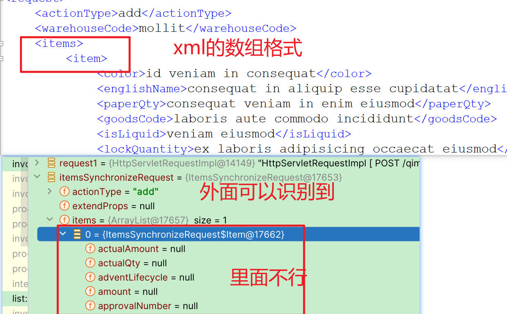
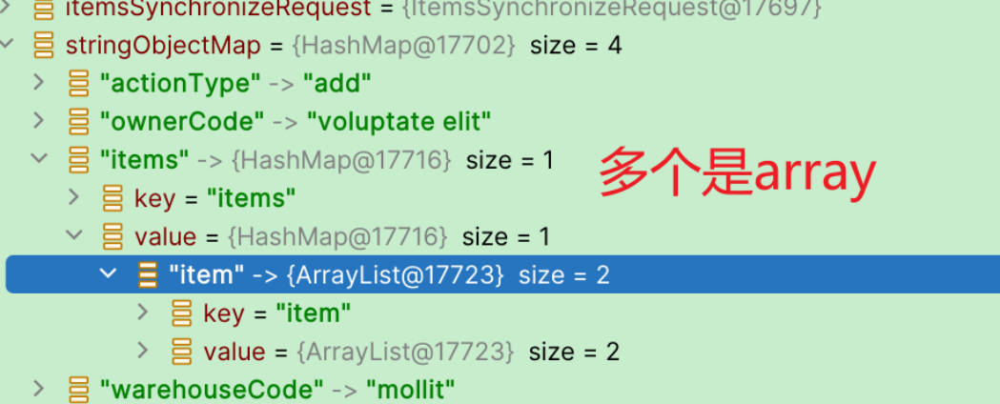
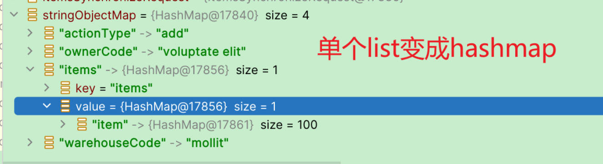
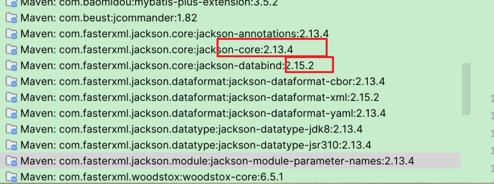
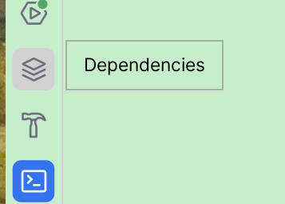

# 问题背景：xml数组识别不到问题
开发奇门的时候奇门的传参都是XML，所以需要用XML转为BEAN好让程序好操作

尝试了好几种办法，转json 转map 转document 最后转为bean都对数组不行






# 采用jackson转换

```xml
<!-- https://mvnrepository.com/artifact/com.fasterxml.jackson.dataformat/jackson-dataformat-xml -->  
<dependency>  
    <groupId>com.fasterxml.jackson.dataformat</groupId>  
    <artifactId>jackson-dataformat-xml</artifactId>  
    <version>2.15.2</version>  
</dependency>
```


```xml
<?xml version="1.0" encoding="UTF-8" ?>  
<book id="1">  
    <name>Java核心技术</name>  

    <isbn lang="CN">1234567</isbn>  
    <diver lang="CN">diver</diver>  
    <tags>  
        <tag>  
        <tagName>java</tagName>  
        </tag>  
        <tag>  
            <tagName>python</tagName>  
        </tag>  
    </tags>  
    <pubDate/>  
</book>
```

```java
@Data  
@Builder  
@AllArgsConstructor  
@NoArgsConstructor  
public class Book2 {  
    public long id;  
    public String name;  
    public String author;  
    public String isbn;  
    public List<Tag> tags;  
    public String pubDate;  

    @Data  
    @Builder  
    @AllArgsConstructor  
    @NoArgsConstructor  
    public static class Tag{  
        private String tagName;  
    }  
}
```

## xml转bean
```java
InputStream input = new ClassPathResource( File.separator + "book2.xml").getInputStream();  
JacksonXmlModule module = new JacksonXmlModule();  
XmlMapper mapper = new XmlMapper(module);  
Book2 book = mapper.readValue(input, Book2.class);  
System.out.println(book.id);  
System.out.println(book.name);  
System.out.println(book.author);  
System.out.println(book.isbn);  
System.out.println(book.pubDate);  
book.tags.forEach(System.out::println);
```

参考：https://www.liaoxuefeng.com/wiki/1252599548343744/1320418596093986
## bean转xml
```java
   Book2.Tag build = Book2.Tag.builder().tagName(".net").build();  
Book2.Tag build2 = Book2.Tag.builder().tagName("ruby").build();  
List<Book2.Tag> tagList = List.of(build, build2);  
Book2 book2 = Book2.builder()  
                .author("Horstmann")  
                .pubDate("2023")  
                .isbn("123123")  
                .id(3)  
                .name("name")  
                .tags(tagList)  
                .build();  
JacksonXmlModule module = new JacksonXmlModule();  
XmlMapper mapper = new XmlMapper(module);  
// bean转xml  
String xml = mapper.writeValueAsString(book2);  
System.out.println(xml);
```

# 无法识别的属性异常 UnrecognizedPropertyException

```java
// 反序列化中 禁用未知属性的异常  
mapper.configure(DeserializationFeature.FAIL_ON_UNKNOWN_PROPERTIES, false);
```

# 后续问题 **streamReadConstraints**异常
最后发现：

在自己的生产项目我引入的是2.15.2，只引入了jackson-dataformat-xml
然后看到里面调用了core包里面的一个方法， 这个方法没有，发现core的版本和jackson-dataformat-xml的不一样，但是我找了整个项目都没找到core的maven在哪配置了。

最后没办法只能把jackson-dataformat-xml讲为和core一样的版本，好像是我用的Springboot2.7.5默认的core是支持2.13.4？ 这个我没研究过也不懂，如果有大佬知道可以评论告知一下。感谢


# IDEA问题：dependencies工具窗口
我还发现一个问题 idea 2023.2里面没有dependencies工具窗口了，降到2023.1就有了，我好晕。。。。。
还是我2023.2他改变位置了？


