# 必会：SpringBoot Actuator

**Actuator 就是为了监控项目的健康程度**

# 三板斧

1. 依赖 
2. 注解
3. 配置

# **配置Actuator**

## 1.依赖

```xml
				<dependency>
            <groupId>org.springframework.boot</groupId>
            <artifactId>spring-boot-starter-actuator</artifactId>
        </dependency>
```

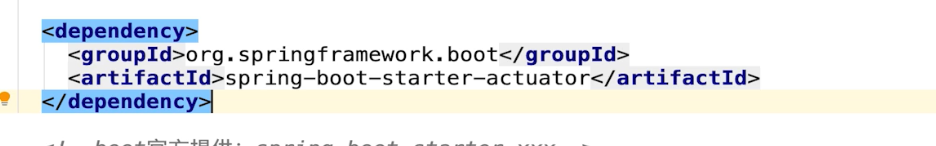

之后会多出这一行

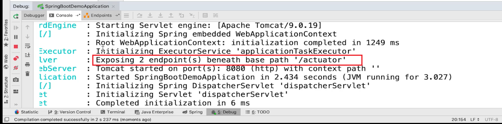

访问

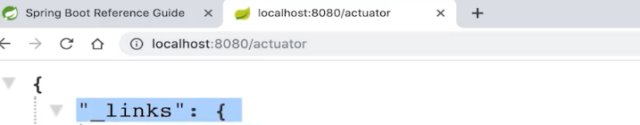

## 3配置（细粒度的配置需要加yml）

```yaml
management:
  endpoints:
    web:
      exposure:
        include: '*'
```

---

```yaml
# 暴露端点
management:
  endpoints:
    web:
      exposure:
        include: '*'
  endpoint:
    health:
      show-details: always
```

---

# 

# 监控端点

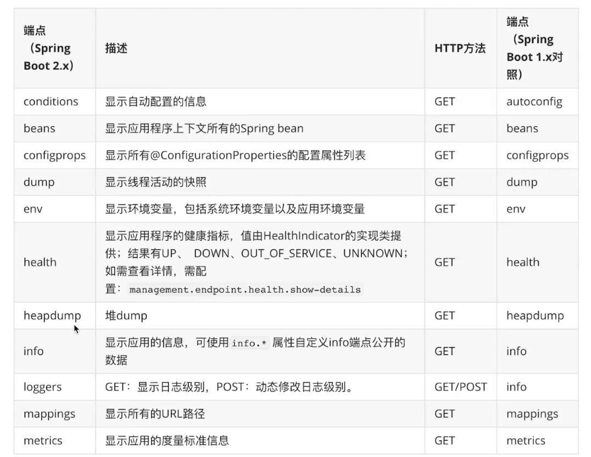

## health 端点

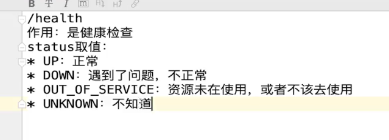

health端点的详情


之后就变成了这种

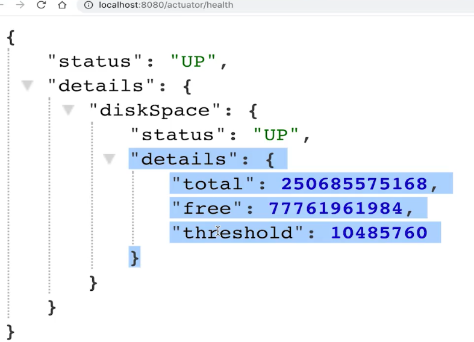

---

## info端点（描述端点）

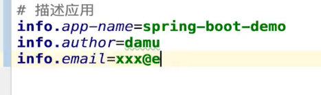

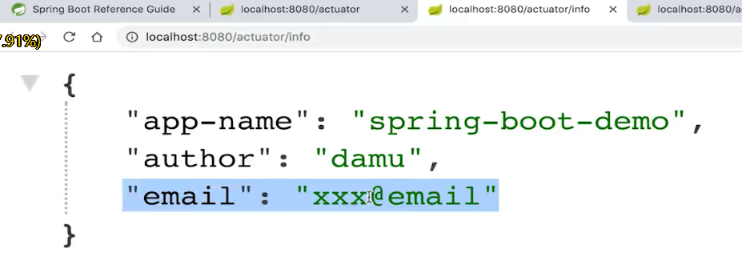

## 激活所有的actuator端点

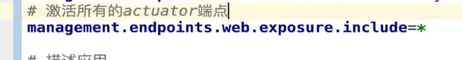

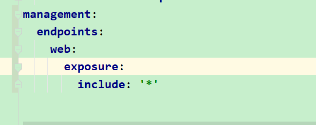

### 举例

### 看配置


### 看JVM线程状态

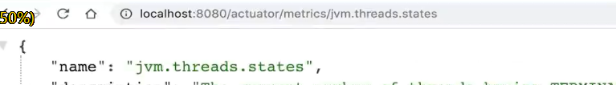

## 只激活 一部分actuator 端点


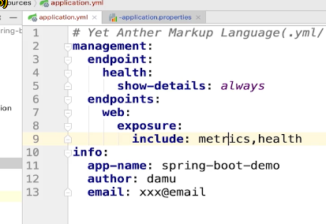
