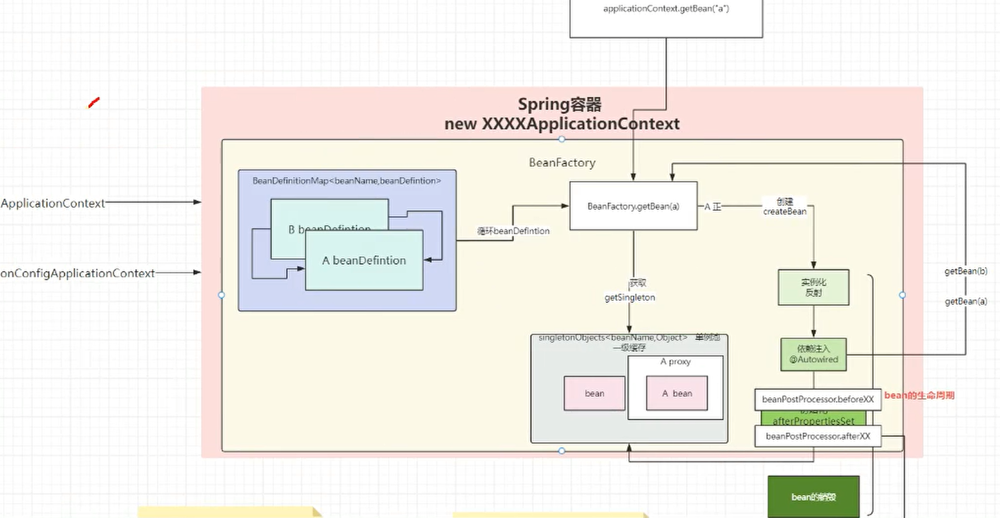
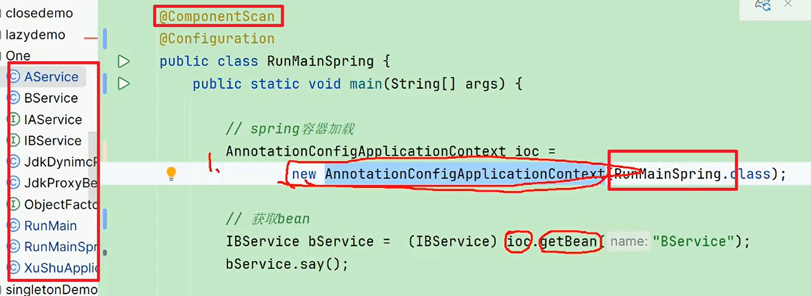
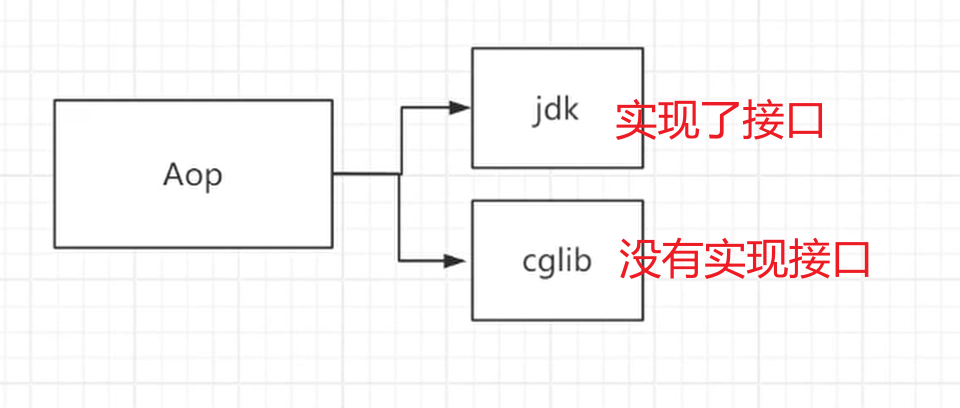

# SpringBoot_ioc容器的加载过程_ioc循环依赖-图灵徐庶

https://1500024016.vod-qcloud.com/43a7c11dvodtranscq1500024016/1502b0eb1397757892770255101/v.f1446751.mp4

## spring ioc容器的加载过程

1. 创建applicationcontext对象，
2. 根据配置类，扫描当前的包，发现有@component注解的类，读取到beanDefintion
3. beanfactory会为我们创建一个一个bean 
4. 创建之前首先会先get，如果get不到进行创建
5. 创建分3步 1. 实例化 2. 依赖注入 3. 初始化
6. 然后放在bean单例池中 [一级缓存]（spring bean默认是单例的 节省内存消耗，放在Concurrentmap<beanName,Object>里）

通过application context.getbean 去map里面去找

## aop
- **JDK动态代理**：基于接口实现，只能代理接口方法。
- **CGLIB代理**：基于继承，可以代理没有实现接口的类或代理类的非接口方法。

