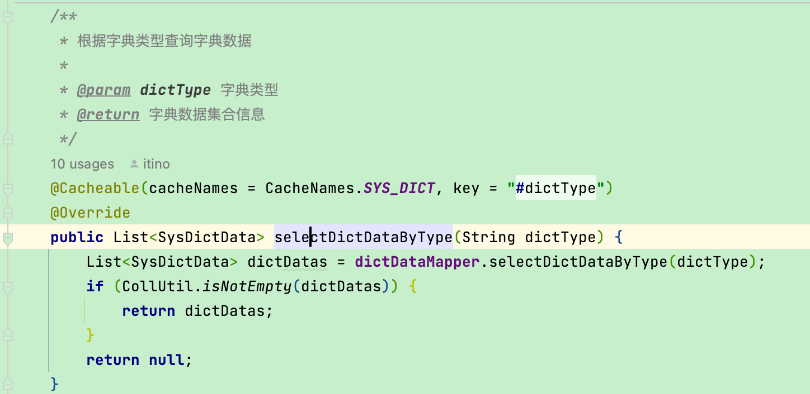
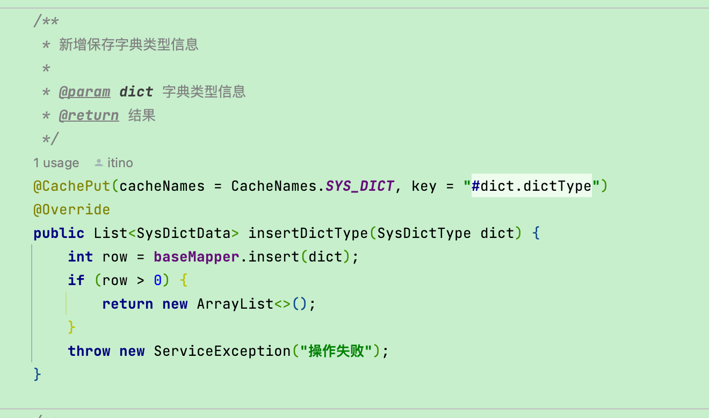
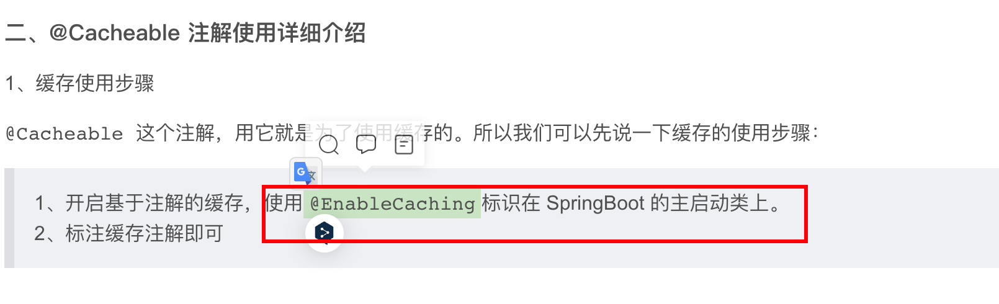
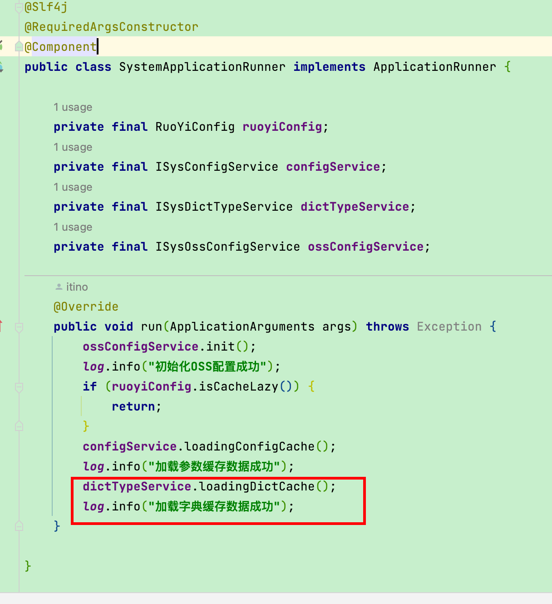
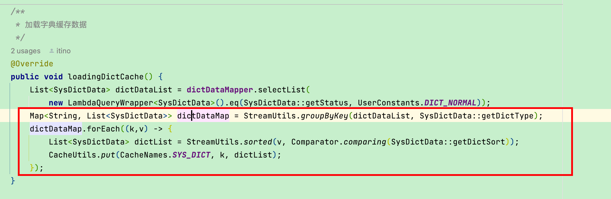
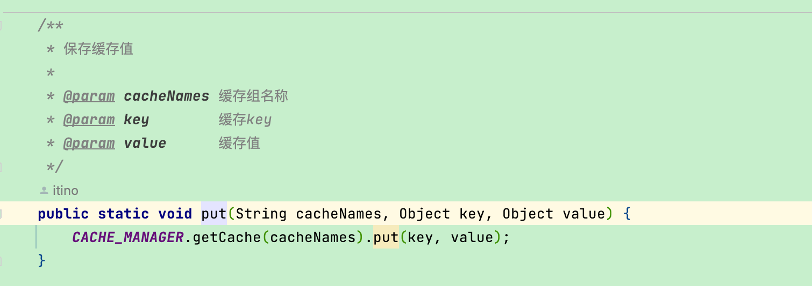
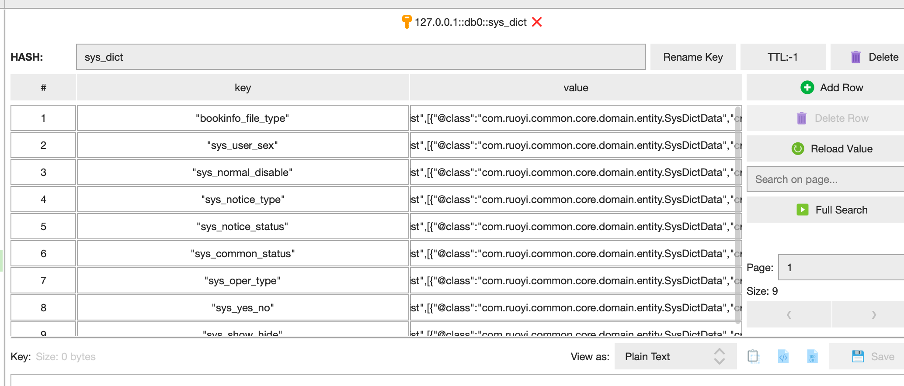

# SpringBoot 缓存之 @Cacheable

在学习开源项目的时候发现里面有没见过的写法。
---

这个 文章说的通俗易懂

[SpringBoot 缓存之 @Cacheable 详细介绍_zl1zl2zl3的博客-CSDN博客](https://blog.csdn.net/zl1zl2zl3/article/details/110987968)

ruoyi plus的整合****Redisson****

[SpringBoot 2.X 集成 Redisson 性能更好 功能更全 分布式锁支持的 Redis客户端_疯狂的狮子Li的博客-CSDN博客](https://lionli.blog.csdn.net/article/details/117463657)

# 前沿

ruoyi项目里这么出现的 





这让我感受到了兴趣

于是我查看了他的源码。发现是这么玩的

# 上代码



## 1.首先项目启动的时候






从启动的时候查询玩就put进去了



- 这个文件的代码
    
    ```java
    package com.ruoyi.common.utils.redis;
    
    import com.ruoyi.common.utils.spring.SpringUtils;
    import lombok.AccessLevel;
    import lombok.NoArgsConstructor;
    import org.redisson.api.RMap;
    import org.springframework.cache.Cache;
    import org.springframework.cache.CacheManager;
    
    import java.util.Set;
    
    /**
     * 缓存操作工具类 {@link }
     *
     * @author Michelle.Chung
     * @date 2022/8/13
     */
    @NoArgsConstructor(access = AccessLevel.PRIVATE)
    @SuppressWarnings(value = {"unchecked"})
    public class CacheUtils {
    
        private static final CacheManager CACHE_MANAGER = SpringUtils.getBean(CacheManager.class);
    
        /**
         * 获取缓存组内所有的KEY
         *
         * @param cacheNames 缓存组名称
         */
        public static Set<Object> keys(String cacheNames) {
            RMap<Object, Object> rmap = (RMap<Object, Object>) CACHE_MANAGER.getCache(cacheNames).getNativeCache();
            return rmap.keySet();
        }
    
        /**
         * 获取缓存值
         *
         * @param cacheNames 缓存组名称
         * @param key        缓存key
         */
        public static <T> T get(String cacheNames, Object key) {
            Cache.ValueWrapper wrapper = CACHE_MANAGER.getCache(cacheNames).get(key);
            return wrapper != null ? (T) wrapper.get() : null;
        }
    
        /**
         * 保存缓存值
         *
         * @param cacheNames 缓存组名称
         * @param key        缓存key
         * @param value      缓存值
         */
        public static void put(String cacheNames, Object key, Object value) {
            CACHE_MANAGER.getCache(cacheNames).put(key, value);
        }
    
        /**
         * 删除缓存值
         *
         * @param cacheNames 缓存组名称
         * @param key        缓存key
         */
        public static void evict(String cacheNames, Object key) {
            CACHE_MANAGER.getCache(cacheNames).evict(key);
        }
    
        /**
         * 清空缓存值
         *
         * @param cacheNames 缓存组名称
         */
        public static void clear(String cacheNames) {
            CACHE_MANAGER.getCache(cacheNames).clear();
        }
    
    }
    ```
    

## 2.然后继承了redis用了redisson



- yml
    
    ```java
    --- # redis 单机配置(单机与集群只能开启一个另一个需要注释掉)
    spring:
      redis:
        # 地址
        host: localhost
        # 端口，默认为6379
        port: 6379
        # 数据库索引
        database: 0
        # 密码(如没有密码请注释掉)
        # password:
        # 连接超时时间
        timeout: 10s
        # 是否开启ssl
        ssl: false
    
    redisson:
      # redis key前缀
      keyPrefix:
      # 线程池数量
      threads: 4
      # Netty线程池数量
      nettyThreads: 8
      # 单节点配置
      singleServerConfig:
        # 客户端名称
        clientName: ${ruoyi.name}
        # 最小空闲连接数
        connectionMinimumIdleSize: 8
        # 连接池大小
        connectionPoolSize: 32
        # 连接空闲超时，单位：毫秒
        idleConnectionTimeout: 10000
        # 命令等待超时，单位：毫秒
        timeout: 3000
        # 发布和订阅连接池大小
        subscriptionConnectionPoolSize: 50
    ```
    
- 根据@EnableCaching查到的配置
    
    ```java
    package com.ruoyi.framework.config;
    
    import cn.hutool.core.util.ObjectUtil;
    import com.fasterxml.jackson.databind.ObjectMapper;
    import com.ruoyi.framework.config.properties.RedissonProperties;
    import com.ruoyi.framework.handler.KeyPrefixHandler;
    import com.ruoyi.framework.manager.PlusSpringCacheManager;
    import lombok.extern.slf4j.Slf4j;
    import org.redisson.codec.JsonJacksonCodec;
    import org.redisson.spring.starter.RedissonAutoConfigurationCustomizer;
    import org.springframework.beans.factory.annotation.Autowired;
    import org.springframework.boot.context.properties.EnableConfigurationProperties;
    import org.springframework.cache.CacheManager;
    import org.springframework.cache.annotation.CachingConfigurerSupport;
    import org.springframework.cache.annotation.EnableCaching;
    import org.springframework.context.annotation.Bean;
    import org.springframework.context.annotation.Configuration;
    
    /**
     * redis配置
     *
     * @author Lion Li
     */
    @Slf4j
    @Configuration
    @EnableCaching
    @EnableConfigurationProperties(RedissonProperties.class)
    public class RedisConfig extends CachingConfigurerSupport {
    
        @Autowired
        private RedissonProperties redissonProperties;
    
        @Autowired
        private ObjectMapper objectMapper;
    
        @Bean
        public RedissonAutoConfigurationCustomizer redissonCustomizer() {
            return config -> {
                config.setThreads(redissonProperties.getThreads())
                    .setNettyThreads(redissonProperties.getNettyThreads())
                    .setCodec(new JsonJacksonCodec(objectMapper));
                RedissonProperties.SingleServerConfig singleServerConfig = redissonProperties.getSingleServerConfig();
                if (ObjectUtil.isNotNull(singleServerConfig)) {
                    // 使用单机模式
                    config.useSingleServer()
                        //设置redis key前缀
                        .setNameMapper(new KeyPrefixHandler(redissonProperties.getKeyPrefix()))
                        .setTimeout(singleServerConfig.getTimeout())
                        .setClientName(singleServerConfig.getClientName())
                        .setIdleConnectionTimeout(singleServerConfig.getIdleConnectionTimeout())
                        .setSubscriptionConnectionPoolSize(singleServerConfig.getSubscriptionConnectionPoolSize())
                        .setConnectionMinimumIdleSize(singleServerConfig.getConnectionMinimumIdleSize())
                        .setConnectionPoolSize(singleServerConfig.getConnectionPoolSize());
                }
                // 集群配置方式 参考下方注释
                RedissonProperties.ClusterServersConfig clusterServersConfig = redissonProperties.getClusterServersConfig();
                if (ObjectUtil.isNotNull(clusterServersConfig)) {
                    config.useClusterServers()
                        //设置redis key前缀
                        .setNameMapper(new KeyPrefixHandler(redissonProperties.getKeyPrefix()))
                        .setTimeout(clusterServersConfig.getTimeout())
                        .setClientName(clusterServersConfig.getClientName())
                        .setIdleConnectionTimeout(clusterServersConfig.getIdleConnectionTimeout())
                        .setSubscriptionConnectionPoolSize(clusterServersConfig.getSubscriptionConnectionPoolSize())
                        .setMasterConnectionMinimumIdleSize(clusterServersConfig.getMasterConnectionMinimumIdleSize())
                        .setMasterConnectionPoolSize(clusterServersConfig.getMasterConnectionPoolSize())
                        .setSlaveConnectionMinimumIdleSize(clusterServersConfig.getSlaveConnectionMinimumIdleSize())
                        .setSlaveConnectionPoolSize(clusterServersConfig.getSlaveConnectionPoolSize())
                        .setReadMode(clusterServersConfig.getReadMode())
                        .setSubscriptionMode(clusterServersConfig.getSubscriptionMode());
                }
                log.info("初始化 redis 配置");
            };
        }
    
        /**
         * 自定义缓存管理器 整合spring-cache
         */
        @Bean
        public CacheManager cacheManager() {
            return new PlusSpringCacheManager();
        }
    
        /**
         * redis集群配置 yml
         *
         * --- # redis 集群配置(单机与集群只能开启一个另一个需要注释掉)
         * spring:
         *   redis:
         *     cluster:
         *       nodes:
         *         - 192.168.0.100:6379
         *         - 192.168.0.101:6379
         *         - 192.168.0.102:6379
         *     # 密码
         *     password:
         *     # 连接超时时间
         *     timeout: 10s
         *     # 是否开启ssl
         *     ssl: false
         *
         * redisson:
         *   # 线程池数量
         *   threads: 16
         *   # Netty线程池数量
         *   nettyThreads: 32
         *   # 集群配置
         *   clusterServersConfig:
         *     # 客户端名称
         *     clientName: ${ruoyi.name}
         *     # master最小空闲连接数
         *     masterConnectionMinimumIdleSize: 32
         *     # master连接池大小
         *     masterConnectionPoolSize: 64
         *     # slave最小空闲连接数
         *     slaveConnectionMinimumIdleSize: 32
         *     # slave连接池大小
         *     slaveConnectionPoolSize: 64
         *     # 连接空闲超时，单位：毫秒
         *     idleConnectionTimeout: 10000
         *     # 命令等待超时，单位：毫秒
         *     timeout: 3000
         *     # 发布和订阅连接池大小
         *     subscriptionConnectionPoolSize: 50
         *     # 读取模式
         *     readMode: "SLAVE"
         *     # 订阅模式
         *     subscriptionMode: "MASTER"
         */
    
    }
    ```
    
- 使用办法
    
    
    
    
    

## 3. 写的扩展的redisson

- 代码
    
    ```java
    /**
     * Copyright (c) 2013-2021 Nikita Koksharov
     *
     * Licensed under the Apache License, Version 2.0 (the "License");
     * you may not use this file except in compliance with the License.
     * You may obtain a copy of the License at
     *
     *    http://www.apache.org/licenses/LICENSE-2.0
     *
     * Unless required by applicable law or agreed to in writing, software
     * distributed under the License is distributed on an "AS IS" BASIS,
     * WITHOUT WARRANTIES OR CONDITIONS OF ANY KIND, either express or implied.
     * See the License for the specific language governing permissions and
     * limitations under the License.
     */
    package com.ruoyi.framework.manager;
    
    import com.ruoyi.common.utils.redis.RedisUtils;
    import org.redisson.api.RMap;
    import org.redisson.api.RMapCache;
    import org.redisson.spring.cache.CacheConfig;
    import org.redisson.spring.cache.RedissonCache;
    import org.springframework.boot.convert.DurationStyle;
    import org.springframework.cache.Cache;
    import org.springframework.cache.CacheManager;
    import org.springframework.cache.transaction.TransactionAwareCacheDecorator;
    import org.springframework.util.StringUtils;
    
    import java.util.Collection;
    import java.util.Collections;
    import java.util.Map;
    import java.util.concurrent.ConcurrentHashMap;
    import java.util.concurrent.ConcurrentMap;
    
    /**
     * A {@link org.springframework.cache.CacheManager} implementation
     * backed by Redisson instance.
     * <p>
     * 修改 RedissonSpringCacheManager 源码
     * 重写 cacheName 处理方法 支持多参数
     *
     * @author Nikita Koksharov
     *
     */
    @SuppressWarnings("unchecked")
    public class PlusSpringCacheManager implements CacheManager {
    
        private boolean dynamic = true;
    
        private boolean allowNullValues = true;
    
        private boolean transactionAware = true;
    
        Map<String, CacheConfig> configMap = new ConcurrentHashMap<>();
        ConcurrentMap<String, Cache> instanceMap = new ConcurrentHashMap<>();
    
        /**
         * Creates CacheManager supplied by Redisson instance
         */
        public PlusSpringCacheManager() {
        }
    
        /**
         * Defines possibility of storing {@code null} values.
         * <p>
         * Default is <code>true</code>
         *
         * @param allowNullValues stores if <code>true</code>
         */
        public void setAllowNullValues(boolean allowNullValues) {
            this.allowNullValues = allowNullValues;
        }
    
        /**
         * Defines if cache aware of Spring-managed transactions.
         * If {@code true} put/evict operations are executed only for successful transaction in after-commit phase.
         * <p>
         * Default is <code>false</code>
         *
         * @param transactionAware cache is transaction aware if <code>true</code>
         */
        public void setTransactionAware(boolean transactionAware) {
            this.transactionAware = transactionAware;
        }
    
        /**
         * Defines 'fixed' cache names.
         * A new cache instance will not be created in dynamic for non-defined names.
         * <p>
         * `null` parameter setups dynamic mode
         *
         * @param names of caches
         */
        public void setCacheNames(Collection<String> names) {
            if (names != null) {
                for (String name : names) {
                    getCache(name);
                }
                dynamic = false;
            } else {
                dynamic = true;
            }
        }
    
        /**
         * Set cache config mapped by cache name
         *
         * @param config object
         */
        public void setConfig(Map<String, ? extends CacheConfig> config) {
            this.configMap = (Map<String, CacheConfig>) config;
        }
    
        protected CacheConfig createDefaultConfig() {
            return new CacheConfig();
        }
    
        @Override
        public Cache getCache(String name) {
            Cache cache = instanceMap.get(name);
            if (cache != null) {
                return cache;
            }
            if (!dynamic) {
                return cache;
            }
    
            CacheConfig config = configMap.get(name);
            if (config == null) {
                config = createDefaultConfig();
                configMap.put(name, config);
            }
    
            // 重写 cacheName 支持多参数
            String[] array = StringUtils.delimitedListToStringArray(name, "#");
            name = array[0];
            if (array.length > 1) {
                config.setTTL(DurationStyle.detectAndParse(array[1]).toMillis());
            }
            if (array.length > 2) {
                config.setMaxIdleTime(DurationStyle.detectAndParse(array[2]).toMillis());
            }
            if (array.length > 3) {
                config.setMaxSize(Integer.parseInt(array[3]));
            }
    
            if (config.getMaxIdleTime() == 0 && config.getTTL() == 0 && config.getMaxSize() == 0) {
                return createMap(name, config);
            }
    
            return createMapCache(name, config);
        }
    
        private Cache createMap(String name, CacheConfig config) {
            RMap<Object, Object> map = RedisUtils.getClient().getMap(name);
    
            Cache cache = new RedissonCache(map, allowNullValues);
            if (transactionAware) {
                cache = new TransactionAwareCacheDecorator(cache);
            }
            Cache oldCache = instanceMap.putIfAbsent(name, cache);
            if (oldCache != null) {
                cache = oldCache;
            }
            return cache;
        }
    
        private Cache createMapCache(String name, CacheConfig config) {
            RMapCache<Object, Object> map = RedisUtils.getClient().getMapCache(name);
    
            Cache cache = new RedissonCache(map, config, allowNullValues);
            if (transactionAware) {
                cache = new TransactionAwareCacheDecorator(cache);
            }
            Cache oldCache = instanceMap.putIfAbsent(name, cache);
            if (oldCache != null) {
                cache = oldCache;
            } else {
                map.setMaxSize(config.getMaxSize());
            }
            return cache;
        }
    
        @Override
        public Collection<String> getCacheNames() {
            return Collections.unmodifiableSet(configMap.keySet());
        }
    
    }
    ```
    

# 扩展

这家伙把 源码给改了，变成了多参数

[SpringBoot 改造 Spring-Cache 注解实现 支持注解指定扩展参数_疯狂的狮子Li的博客-CSDN博客](https://blog.csdn.net/weixin_40461281/article/details/126346683?ops_request_misc=%257B%2522request%255Fid%2522%253A%2522166875439416782425611401%2522%252C%2522scm%2522%253A%252220140713.130102334.pc%255Fblog.%2522%257D&request_id=166875439416782425611401&biz_id=0&utm_medium=distribute.pc_search_result.none-task-blog-2~blog~first_rank_ecpm_v1~rank_v31_ecpm-1-126346683-null-null.nonecase&utm_term=Cacheable&spm=1018.2226.3001.4450)
