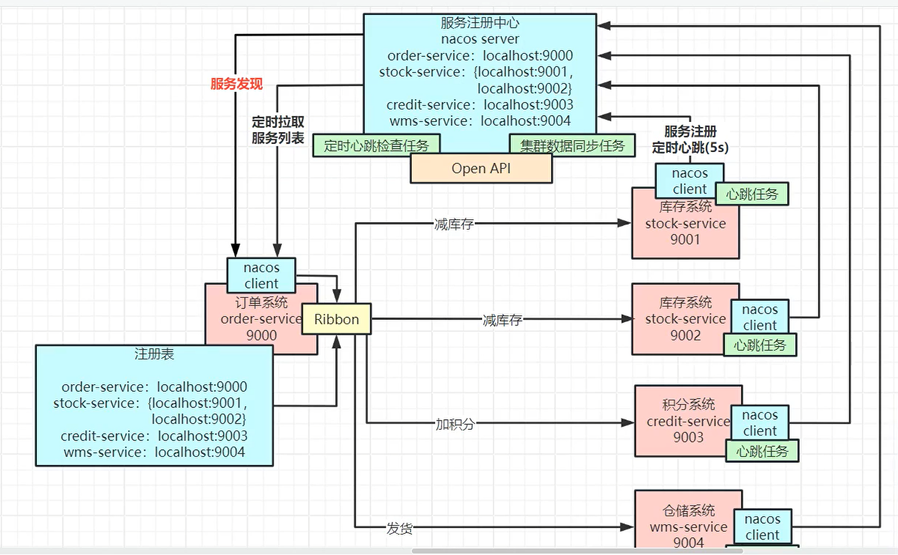

# SpringCloudAlibaba微服务相关核心公开课记录-图灵诸葛

回放：[链接1](https://ab.shkt.online/c/18aOk5SA2) [链接2](https://1500024016.vod-qcloud.com/43a7c11dvodtranscq1500024016/3321bdc51253642697180933344/v.f1446751.mp4)

资料： [https://pan.baidu.com/s/1uCG5xn8fbHfVodCjEya3Nw?pwd=xshi](https://pan.baidu.com/s/1uCG5xn8fbHfVodCjEya3Nw?pwd=xshi) 提取码: xshi

## 微服务优点缺点

优点：

1. 项目管理上，部门人多分开负责好管理。

2. 业务拆分开，假如后面会员服务oom挂了， 不影响别的业务模块

3. 不同服务可以针对不同数据库，缓解数据库水平扩容

4. 比如双11，这种大促，可以针对交易模块单独扩容。

缺点：

1. 架构更复杂，

2. 链路更复杂 

3. 事务更复杂 

4. 维护更繁琐

## nacos+ribbon注册中心服务发现



client引入nacos依赖，yml配置nacos地址。

**问：ribbon 微服务注册中心怎么做到服务的上下限自动感知的**

**加机器：**

ribbon 每过几秒定时拉取 注册中心

**减机器：**

比如订单服务里面引入nacos依赖，会每隔几秒发送心跳，通过http（1.0版本）  grcp （2.0版本）发送心跳 ，告诉服务器存活，nacos服务端也有一个定时心跳检查任务，如果订单服务有一定的时间没发心跳就会认为他挂了

## 引入openfeign


大概原理：


openfeign原理，动态代理，底层拼接url， 然后借助ribbon

## 高可用三板斧(sentinel)

### 1 降级

```yml
feign:
	sentinel:
	# 开启sentinel对feign的支持
	enabled: true
```

pom引入sentinel依赖


**原理：**

底层其实使用try catch包起来的，try是http请求方法，catch方法快写的是fallback指向的类里的同名方法


### 2 限流

背景：订单接口只能承受1w/s，这时候有10w的请求过来。为了避免服务器崩掉

采用sentinel

限流需要下载sentinel 服务端包， java -jar sentinel-dashboard-1.8.0.jar

yml 配置sentinel地址 具体看官方文档

登录sentinel服务器，在sentinel里面这只接口的限流数量

### 3 熔断

把一条原有的通路直接熔断掉。比如：我原本就知道加积分的接口挂掉了，那我就不调用接口了，减少网络通信请求，直接调用加积分接口的降级方法

**降级熔断不分家。**

共设置了10秒（熔断时长），如果从第1秒到第5秒，一共请求了100个请求，有80个请求都报错的，启动熔断，这10秒中的后5秒不再调用请求了， 这10秒全部走过了， 再发起请求恢复熔断。


**原理：**限流和熔断是 滑动时间窗

## 分布式事务

采用seata，启动seata服务器，

注意： seata会影响接口性能，但是不会影响很大，如果业务场景是高并发，其实不推荐使用seata，因为会在整个业务的操作过程中加很多锁。

seata据说是支付宝开源出来的，所以他对高并发没有很大要求，对数据一致性要求比较大。 

**原理：**

通过数据库的undo log，进行事务的回滚.

[undo log 讲解](https://xiaolincoding.com/mysql/log/how_update.html#%E4%B8%BA%E4%BB%80%E4%B9%88%E9%9C%80%E8%A6%81-buffer-pool)

