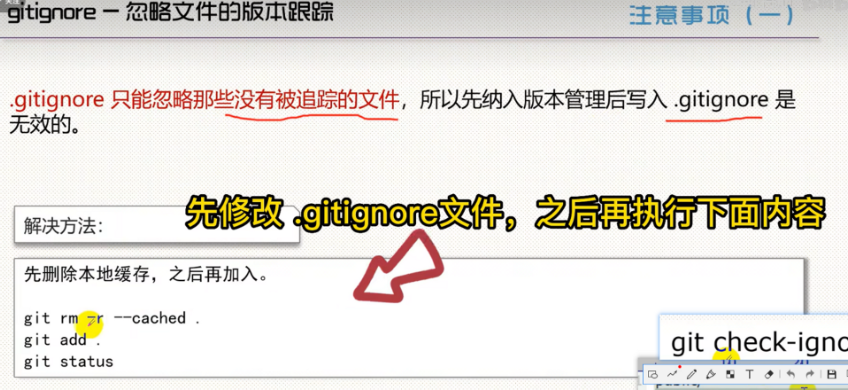

# 1. gitignore忽略文件版本追踪
1. 背景

   在项目中，并不所有文件都要进行版本追踪（如日志文件）。使用 .gitignore 是最简单配置git忽略文件版本追踪的方式。

2. 怎么用

   2.1 在 项目 根目录创建 .gitignore 文件。（注意：不一定非要放在项目根目录，这样写是为了让项目下的所有文件都生效）

   2.2 用文本编辑器打开文件，进行配置：

    - 每项配置独占一行。
    - 每行的内容可以是：文件/目录 的名称、路径 或 它们的模式匹配。


# 3. 模式匹配

(1) **空行**不匹配任何文件，因此常用作分隔符（以方便阅读）。

(2) **#** 用于注释，**\** 表示转义（如对 a!bc.txt，需改为 a\!bc.txt）。

(3). ***** 可以匹配任何字符(0或多次)，**?** 可以匹配任何字符(1次)。（注意：它们都不可以匹配 / ）。

### (4) **/** 用于分隔目录：


💡 在开头  末尾的作用

::: info 开头
 1. 当 **/** 在**开头**时，表示从项目根目录开始匹配。否则，下级都将匹配。

   举例： /abc 只能匹配 /abc，不能匹配 /x/abc 或 /x/y/abc等。
:::
::: info 末尾
 2. 当 **/** 在**末尾**时，只匹配目录，否则，则同名的目录和文件都将匹配。
     举例： /abc/ 只能匹配 /abc目录，不能匹配/abc文件。
     举例： abc/ 能匹配 /abc/ 或 /x/abc/ 或 /x/y/abc/等，不能匹配 /abc 或 /x/abc 等。
:::


(5) 原先被排除的文件，使用 **!** 模式后该文件将会重新被包含。但如果了该文件的父级目录被排除了，那么使用 ! 也不会再次被包含。

(6) **[]** 通常用于匹配一个字符列表，如：a[mn]z 可匹配 amz 和 anz。

(7). ** 用于匹配多级目录，如 a/**/b 可匹配 "a/b", "a/x/b", "a/x/y/b" 等 。

# 4. ignore规则检查

```bash
git check-ignore -v {文件或目录路径}
```

有输出则表示这个 {文件或目录路径} 或目录是被忽略的（如下图）。

# 5. 已有过版本追踪的文件如何忽略？

方法：先加入.gitignore文件->加入gitignore -> 删除本地缓存 -> 重新add 。

```bash
git rm -r --cached .

git add .

git status 
```



6. 恢复文件的版本追踪

方法：从gitignore中移除配置 -> 重新 add。

> 转载 https://www.bilibili.com/read/cv19909520/

> 本文视频教程：https://www.bilibili.com/video/BV1EG4y1Z7WW/
