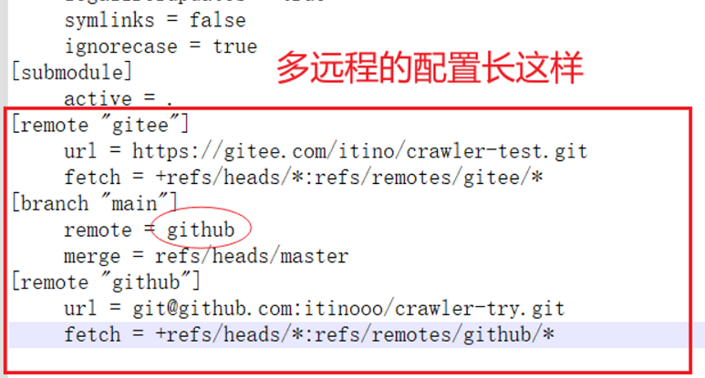

# git 命令

# 添加远程仓库

```bash
git remote add <远程名> <远程地址>
```

# 重命名远程仓库name

```bash
git remote rename 原名字 目标名
```

# 查看远程仓库信息

```bash
git remote -v
```

# 查看日志（包含commit SHA）

```bash
git log
```

```bash
git log -n <number>        命令，其中 <number> 是你想要查看的提交数量
```

# 简短日志

```bash
git log --oneline
```

# pull 拉取远程

```bash
git pull 远程仓库名 远程仓库分支
```

# push 推送远程

```bash
git push -u 远程仓库名 远程仓库分支
```

# ****push指定commit推送****

```bash
git push <remotename> <commit SHA>:<remotebranchname>
```

例如

```bash
git push gitee 2f0897ac2565c1bcce8eb6e0d34b85226c6929db:master
```

- `<remotename>`：远程仓库的名称。通常情况下，远程仓库的默认名称是`origin`，但你也可以设置其他名称。
- `<commit SHA>`：要推送的本地提交的 commit 号（哈希值）。这是你想要将其推送到远程仓库的特定提交。
- `:`（冒号）：用于分隔本地提交和远程分支的分隔符。
- `<remotebranchname>`：远程仓库的分支名称，表示你希望将本地提交推送到的目标分支。

# git将某分支的某次提交合并到另一分支
把（dev分支）的某一次提交合并到（master分支），这就需要`git cherry-pick`命令。

首先，切换到dev分支，用 git log 命令，查找需要合并的commit记录，比如commit id ：fb40e111；

然后，切换到master分支，使用 `git cherry-pick fb40e111 `，把该条commit记录合并到了master分支，这只是在本地合并到了master分支；

最后，git push 提交到master远程，至此，就dev分支的这条commit的记录合并到了master分支。
---
idea操作更方便


# 配置本地git的name和邮箱

``` bash
git config --global user.name "VAYO"
git config --global user.email "yaogogo@88.com"
```

# 配置本地仓库分支默认推送的远程地址

``` bash
git config branch.main.remote github
```

这条命令将会将"main"分支的`remote`属性设置为"github"。你可以在项目的根目录下执行该命令。



# 本地当前分支重命名

`git branch -M main`命令的作用是将当前分支重命名为`main`。`-M`选项表示强制重命名，即使存在与新名称相同的分支也会覆盖它。如果当前分支不是`main`，该命令将当前分支重命名为`main`，否则不会有任何效果。

重命名分支后，你可以使用`git branch`命令来查看分支列表，确认当前分支已经更名为`main`。
