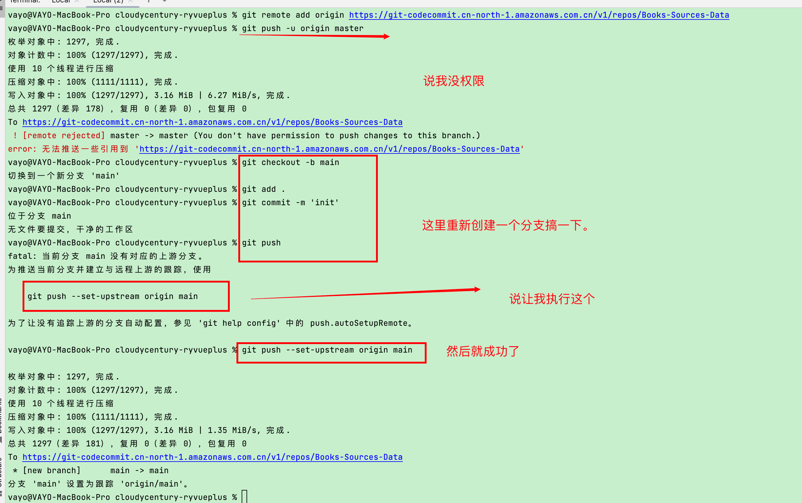

# 本地代码上传到新的git仓库

# 1.先在gitee创建仓库

# 2. 本地创建文件夹。然后进入这个文件夹
有现成的文件夹了直接进入就好
> 💡 拉取别人的代码的话 删掉git和gitee


## 2.2然后输入这三个命令 init add. commit

```bash
git init
git add .
git commit -m "first"
```

# 3. 配置远程地址remote然后push

```bash
git remote  add <远程名> <远程地址>
git push <remote> <branch>`
```

> git push -u  什么意思
>

简单来说使用git push -u origin master以后就可以直接使用不带别的参数的git pull从之前push到的分支来pull。更详细的解说请参看StackOverflow：[http://stackoverflow.com/quest](https://link.zhihu.com/?target=http%3A//stackoverflow.com/questions/5697750/what-exactly-does-the-u-do-git-push-u-origin-master-vs-git-push-origin-ma)

# 对于error: failed to push some refsto‘远程仓库地址’

1 使用如下命令（执行 git pull --rebase 的时候必须保持本地目录干净）
git pull --rebase origin master

2 然后再进行上传:

git push -u origin master

# 当最后push 的时候说没权限（用的亚马逊的git）

