# WIN10的Maven的安装与配置，配置文件放.m2目录下一份。

> 转载：[https://blog.csdn.net/qq_27022241/article/details/108405545](https://blog.csdn.net/qq_27022241/article/details/108405545)

## 第一步：安装JDK并配置环境变量

注意：全部配置到系统变量或者用户变量！！

cmd输入java -version验证是否安装：

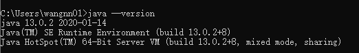

## 第二步：安装Maven

下载地址：

```
http://maven.apache.org/download.cgi
```

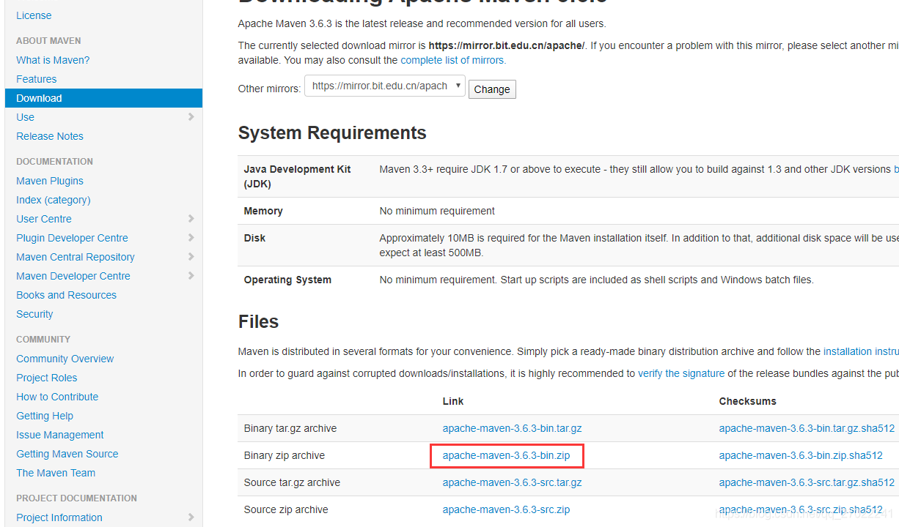

下载好之后，解压并选择存放路径：

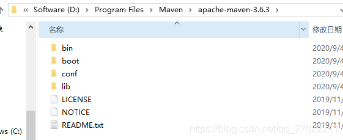

## 第三步：Maven环境变量配置

首先打开我的电脑->属性->高级系统设置。

新建系统变量：MAVEN_HOME，复制Maven的路径：

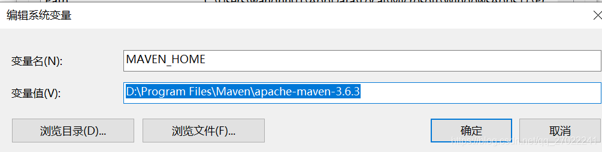

在系统变量：Path中复制粘贴：%MAVEN_HOME%\bin：

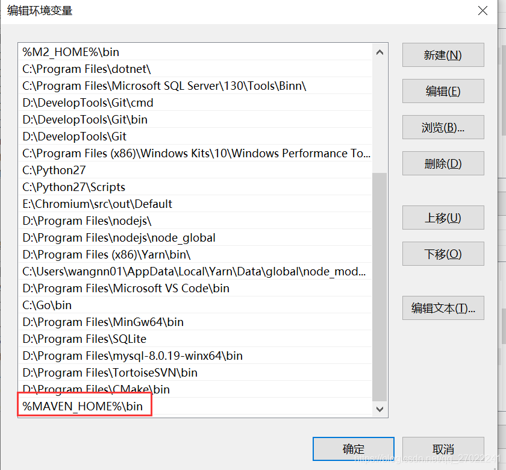

Win+R快捷键打开命令行，输入：mvn -v，如出现以下图样，则表示配置成功：

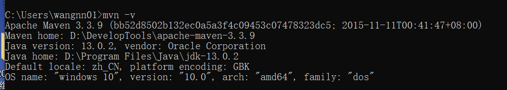

## 第四步：配置本地仓库

**为什么要修改本地c盘仓库位置？**
Maven会自动为咱们添加相应的jar包，而这个jar包会先在本地仓库(maven本地仓库默认是在C:\Users\用户名.m2 下)中查找，如果本地仓库中找不到，则会去中央仓库(网络上)去进行下载。--> 因此不建议把下载的jar包放在系统盘，会占空间~~

## **把本地仓库配置在非系统盘：**

### ①拷贝settings.xml文件到C:\Users\Administrator\.m2路径下：

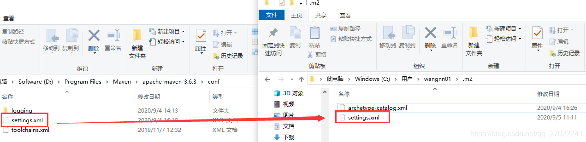

### ②准备本地仓库，我的放在如下位置：

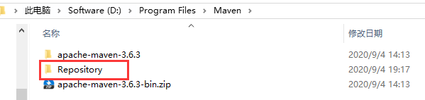

### ③配置文件settings.xml里设置仓库路径 (注意删除原来的.m2下的repository文件夹)：

> <localRepository>D:\Program Files\Maven\Repository</localRepository>
> 

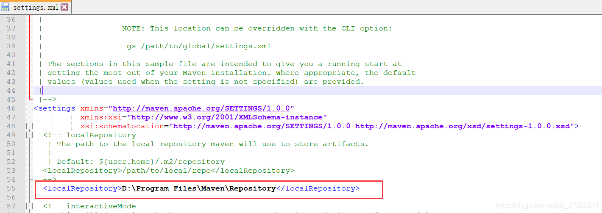

配置完成后验证是否成功，打开cmd命令输入mvn help:system。

maven开始下载一些基本的jar包，此时打开你设置的本地仓库可以看到已经多出很多文件夹了，里面就是maven从中央仓库下载的jar包。

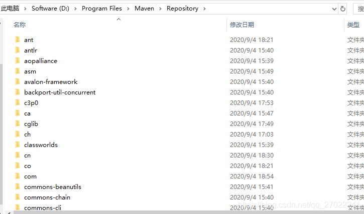

## 第五步：配置Maven镜像源

如果觉得在中央仓库下载jar的时候很慢，可以试试其它maven仓库。

在settings.xml文件里的mirrors节点添加如下子节点：

```
<mirror>
        <id>nexus-aliyun</id>
        <mirrorOf>central</mirrorOf>
        <name>Nexus aliyun</name>
        <url>http://maven.aliyun.com/nexus/content/groups/public</url>
</mirror>
	
<mirror>
      <id>nexus-163</id>
      <mirrorOf>*</mirrorOf>
      <name>Nexus 163</name>
      <url>http://mirrors.163.com/maven/repository/maven-public/</url>
</mirror>
	
<mirror>
      <id>inspurmaven</id>
      <mirrorOf>*</mirrorOf>
      <name>inspur</name>
      <url>http://maven.inspur.com/repository/maven-public/</url>
</mirror>
```

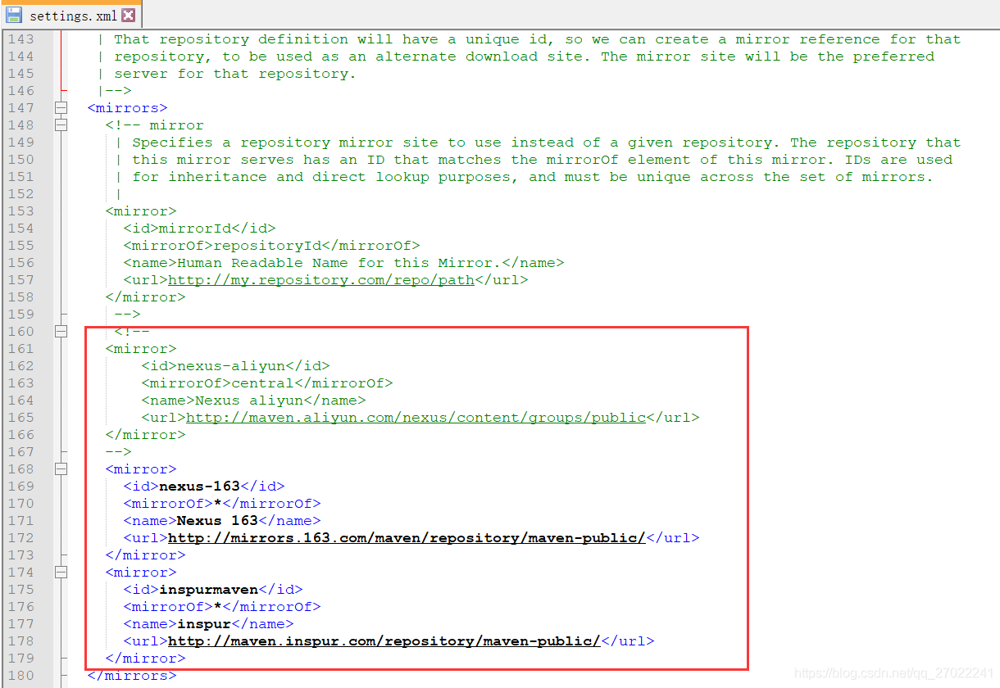

OK，Maven就配置好了！

## 第六步：IDEA中配置Maven

接下来打开IDEA，进入下方界面，选择右下角Configure->Settings（目的是全局配置）：

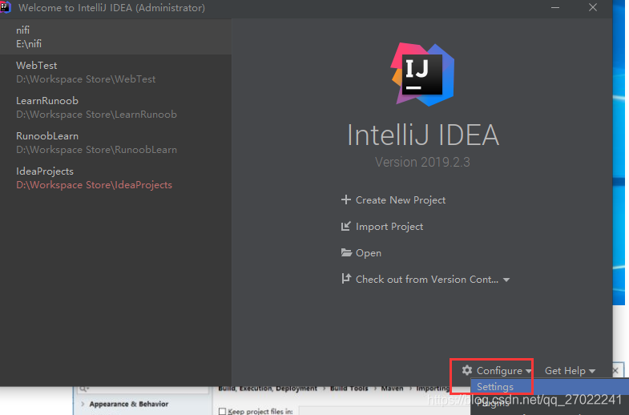

选择Settings->Maven->Importing，把下列选项勾选上，点击Apply->OK

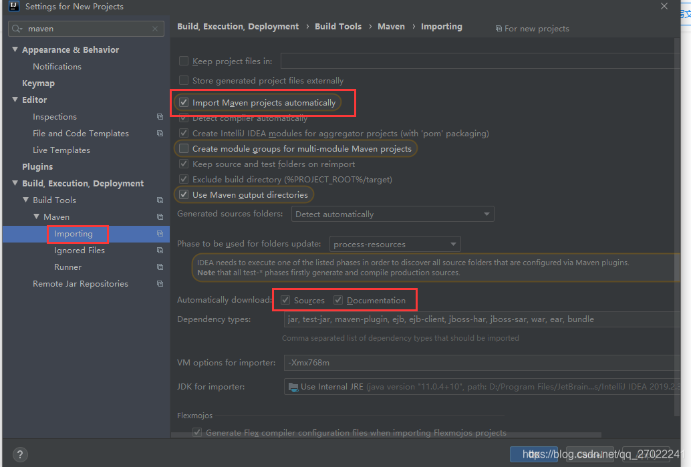

选择Settings->Maven，选择自己Maven存放的路径；然后选择下一行的User settings file，选择settings.xml文件的存放路径，最后点击Apply->OK

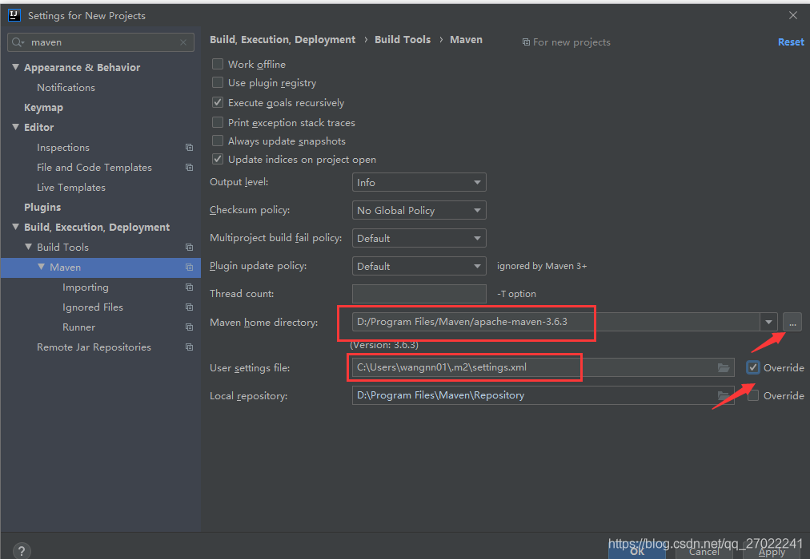

OK，Maven在IDEA中也配置好了~~
