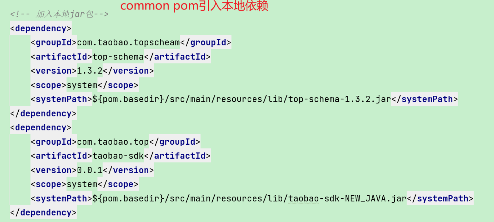
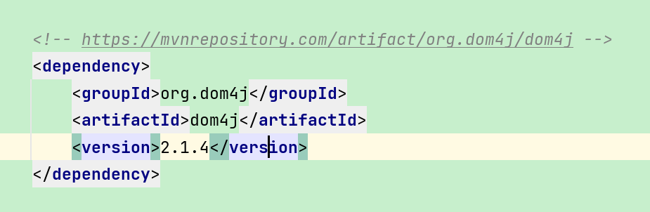

# maven加载本地jar依赖 引用问题（最后清理idea缓存得到解决）

# 问题描述：

引入本地依赖没问题，最后引用的时候报错说**无法访问**本地以来里面的某包

## 本地依赖不包含任何内置依赖

>💡 **里面需要的依赖都得你自己引入**

 

# 寻找问题

1. 重新引入本地以来，重新加载都不行（其中一个细节就是 右上角不自动出来 加载maven更新的按钮）
2. maven重新clean install 都不行
3. 重新删除了本地依赖，重新去官网下载本地依赖都不行。
4. 把代码放在新项目里面就可以，（期间我以为是父子pom引入的问题，其实不是）

# 问题解决

1. 最后头皮发麻的不知所措，清理了idea的缓存可以了 。真™…

> 💡  清maven 清idea 重启

