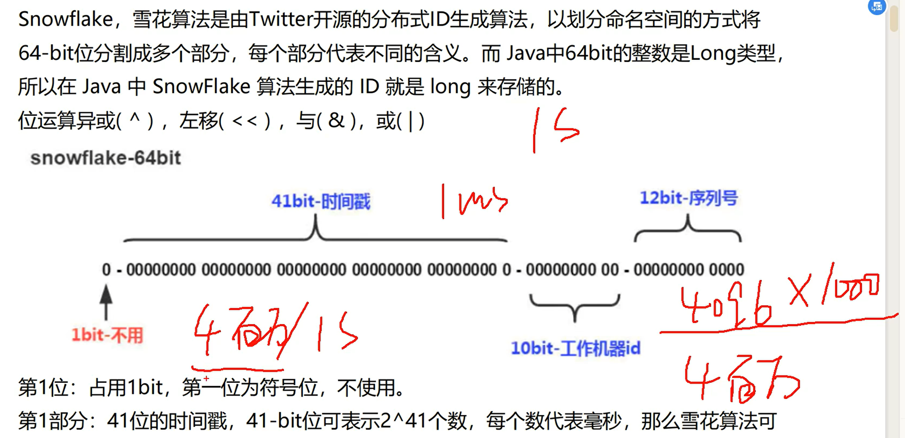
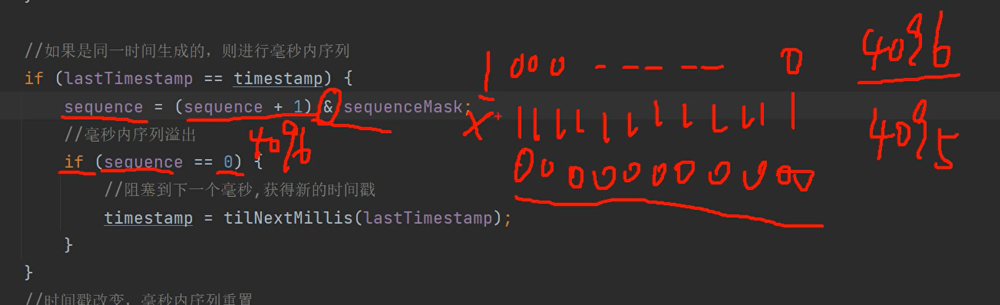
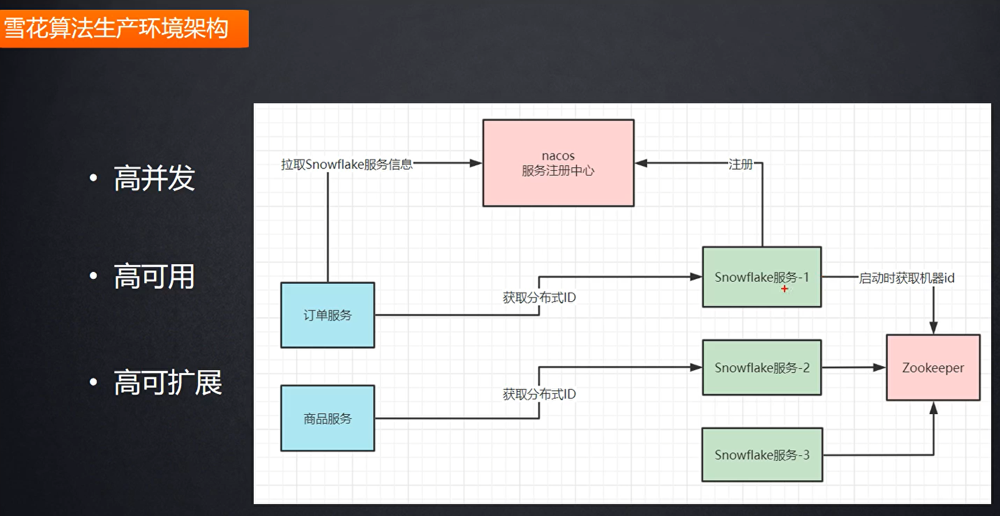
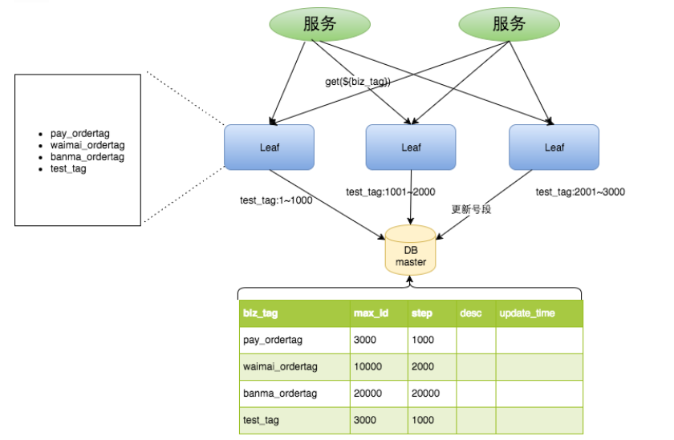

# 分布式ID雪花算法-图灵诸葛

回放 [https://ab.shkt.online/c/3vSqUsht1](https://ab.shkt.online/c/3vSqUsht1)
配套课程资料https://pan.baidu.com/s/18w0GSYmiQ7XI6vwtDOdzDQ 提取码: qiao

## 分布式id生成方式

- uuid （不是自增不建议）
- 数据库自增id
- redis
- 雪花算法Snowflake

### 雪花算法Snowflake

Snowflake，雪花算法是由Twitter开源的分布式ID生成算法，以划分命名空间的方式将64-bit位分割成多个部分，每个部分代表不同的含义。而 Java中64bit的整数是Long类型，所以在 Java 中 SnowFlake 算法生成的 ID 就是 long 来存储的。位运算异或( ^ ) ，左移( << ) ，与( & )，或( | )



第1位：占用1bit，第一位为符号位，不使用。

第1部分：41位的时间戳，41-bit位可表示2^41个数，每个数代表毫秒，那么雪花算法可用的时间年限是(2^41)/(1000*60*60*24*365)=69 年的时间。

第2部分：10-bit位可表示机器数，即2^10 = 1024台机器，通常不会部署这么多台机器，（细分两部分5-bit（数据），5-bit(2^5)=32台机器）也可划分多个部分，

第3部分：12-bit位是自增序列，可表示2^12 = 4096个数。觉得一毫秒个数不够用也可以调大点

41位时间戳是固定的，时间戳转二进制的长度是41位，后面两个部分都可以灵活调正，只

要注意后面位运算的位数就行.

同一毫秒并发过大得情况，这边经过二进制计算发现 序列号超了后会阻塞到下一个毫秒再生成id



雪花算法生产环境架构



**雪花算法时钟回拨问题**

- 回拨时间很短（<=100ms）    阻塞
- 回拨时间适中（>100ms<=1s)   1s内=1000ms内毫秒对应得序列号缓存
- 回拨时间较长（> 1s<=5s)   雪花id服务器分布式部署，如果出现始终回拨就调用别的服务
- 回拨时间很长（>5s）

mybatisplus里面得解决方案是第一种，阻塞，但是不是用的sleep，是用的private final native void wait0方法，

解释：`wait0` 方法声明为 `native`，表示它是一个**本地方法**，其实现由底层的**本地代码**（通常是用 C 或 C++ 编写的）来提供，而不是直接用 Java 编写。`native` 关键字告诉 JVM，这个方法的具体实现不在 Java 代码中，而是在本地库（通常是与 JVM 一起编译的共享库）中。

---

### 数据库自增id

重要字段说明：biz_tag用来区分业务，max_id表示该biz_tag目前所被分配的ID号段的最大值，step表示每次分配的号段长度。原来获取ID每次都需要写数据库，现在只需要把step设置得足够大，比如1000。那么只有当1000个号被消耗完了之后才会去重新读写一次数据库。读写数据库的频率从1减小到了1/step，

大致架构如下图所示：



est_tag在第一台Leaf机器上是1~1000的号段，当这个号段用完时，会去加载另一个长度为step=1000的号段，假设另外两台号段都没有更新，这个时候第一台机器新加载的号段就应该是3001~4000。同时数据库对应的biz_tag这条数据的max_id会从3000被更新成4000，更新号段的SQL语句如下：

```sql
Begin
UPDATE table SET max_id=max_id+step WHERE biz_tag=xxx
SELECT tag, max_id, step FROM table WHERE biz_tag=xxx
Commit
```

**如果并发太多考虑双buffer（step）优化**