# expaln聚合索引

*`system > const > eq_ref > ref > range > index > ALL`*

```sql
#示例表：

CREATE TABLE `employees` (
                             `id` int(11) NOT NULL AUTO_INCREMENT,
                             `name` varchar(24) NOT NULL DEFAULT '' COMMENT '姓名',
                             `age` int(11) NOT NULL DEFAULT '0' COMMENT '年龄',
                             `position` varchar(20) NOT NULL DEFAULT '' COMMENT '职位',
                             `hire_time` timestamp NOT NULL DEFAULT CURRENT_TIMESTAMP COMMENT '入职时间',
                             PRIMARY KEY (`id`),
                             KEY `idx_name_age_position` (`name`,`age`,`position`) USING BTREE) ENGINE=InnoDB AUTO_INCREMENT=4 DEFAULT CHARSET=utf8 COMMENT='员工记录表';

INSERT INTO employees(name,age,position,hire_time) VALUES('LiLei',22,'manager',NOW());

INSERT INTO employees(name,age,position,hire_time) VALUES('HanMeimei',23,'dev',NOW());

INSERT INTO employees(name,age,position,hire_time) VALUES('Lucy',23,'dev',NOW());

```

# 1. 全值匹配    key_len = 74 78 140

```sql

EXPLAIN SELECT * FROM employees WHERE name= 'LiLei';
EXPLAIN SELECT * FROM employees WHERE name= 'LiLei' AND age = 22;
EXPLAIN SELECT * FROM employees WHERE name= 'LiLei' AND age = 22 AND position ='manager';
EXPLAIN SELECT * FROM employees WHERE name= 'LiLei' and position = 'manager';
```

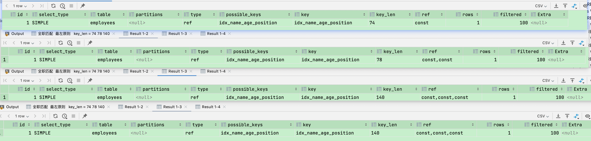

# 2. 第一个匹配 后两个不行  最左原则


💡 最左原则不是从左到右，而是必须有最左


```sql

EXPLAIN SELECT * FROM employees WHERE name = 'Bill' and age = 31;
EXPLAIN SELECT * FROM employees WHERE age = 30 ;
EXPLAIN SELECT * FROM employees WHERE age = 30 AND position = 'dev';
EXPLAIN SELECT * FROM employees WHERE position = 'manager';
```

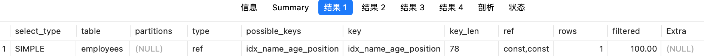

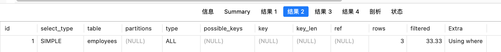

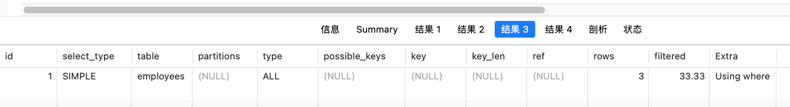

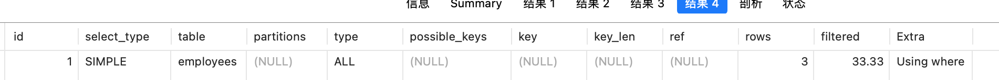

# 3.函数会让索引失效 left


💡 **不在索引列上做任何操作（计算、函数、（自动or手动）类型转换），会导致索引失效而转向全表扫描**


```sql
EXPLAIN SELECT * FROM employees WHERE name = 'LiLei';

EXPLAIN SELECT * FROM employees WHERE left(name,3) = 'LiLei';
```

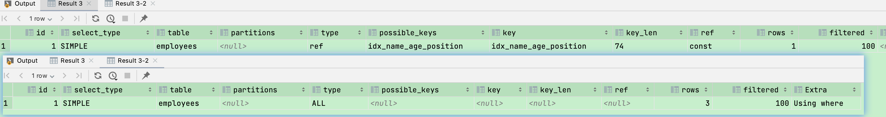

# 4.**尽量使用覆盖索引（只访问索引的查询（索引列包含查询列）），减少 select * 语句**

```sql
EXPLAIN SELECT name,age FROM employees WHERE name= 'LiLei' AND age = 23 AND position='manager';
```

# 5. **范围条件右边的列  `>` 索引失效**


💡 **在`age>22`的情况下，position不一定是有序的，所以有可能不走索引**


💡 **`<` 小于、 `>` 大于、 `<=`、`>=` 这些，mysql内部优化器会根据检索比例、表大小等多个因素整体评估是否使用索引**


```sql
EXPLAIN SELECT * FROM employees WHERE name= 'LiLei' AND age = 22 AND position ='manager';
EXPLAIN SELECT * FROM employees WHERE name= 'LiLei' AND age > 22 AND position ='manager';
```

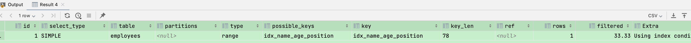

# 6.**mysql在使用不等于（`!=`或者`<>`），not in ，not exists 的时候无法使用索引**


💡 *`- mysql在使用不等于（！=或者`<>`），not in ，not exists 的时候无法使用索引会导致全表扫描，- `<` 小于、 `>` 大于、 `<=`、`>=` 这些，mysql内部优化器会根据检索比例、表大小等多个因素整体评估是否使用索引`*


💡 !=的结果集可能太多了，效率可能和全表扫描差不多，所以有可能不走索引。


```sql
EXPLAIN SELECT * FROM employees WHERE name != 'LiLei';
```

# 7. **is null,is not null   无法使用索引**

```sql
EXPLAIN SELECT * FROM employees WHERE name is null;
```

# 8. **like以通配符开头（'%abc...'）mysql索引失效会变成全表扫描操作**

```sql
-- 百分号在前，%Lei 跳过了索引树前面的字段，是无序的。
EXPLAIN SELECT * FROM employees WHERE name like '%Lei. --**无效**
```

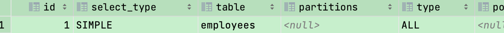

```sql
-- 百分号在后，Lei% 跳过了索引树后面的字段，是有序的，所以可以走索引。
EXPLAIN SELECT * FROM employees WHERE name like 'Lei%';
```

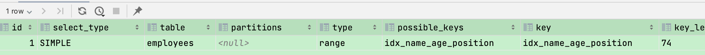

## 8.1 *`问题：解决like'%字符串%'索引不被使用的方法？`*

- *`- a）**使用覆盖索引，查询字段必须是建立覆盖索引字段**`*

```sql
**EXPLAIN SELECT** ****FROM** employees **WHERE name like '%Lei%'**; *- 不可以* 
```

```sql
**EXPLAIN SELECT name**,**age**,**position FROM** employees **WHERE name like '%Lei%'**; *- 可以-* 
```

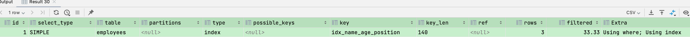

- *`b）如果不能使用覆盖索引则可能需要借助搜索引擎`*

# 9. **字符串不加单引号 索引失效**

```sql
EXPLAIN SELECT * FROM employees WHERE name = '1000';  --有效

EXPLAIN SELECT * FROM employees WHERE name = 1000;  --失效
```

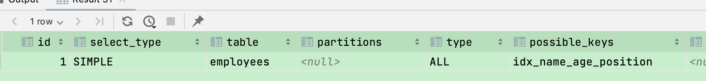

# 10. **少用or或in  索引失效**


💡 **mysql内部优化器会根据检索比例、表大小等多个因素整体评估是否使用索引，详见范围查询优化**


```sql
EXPLAIN SELECT name,age,position FROM employees WHERE name = 'LiLei' or name = 'HanMeimei';
```

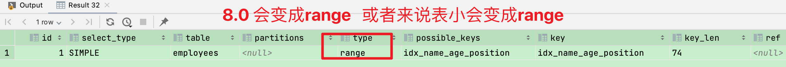

# 11. **范围查询优化**

```sql
-- 加索引
ALTER TABLE `employees` ADD INDEX `idx_age` (`age`) USING BTREE ;

explain select * from employees where age >=1 and age <=2000;
```

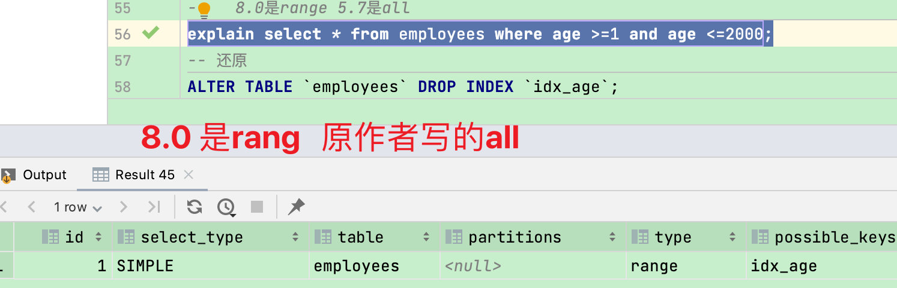

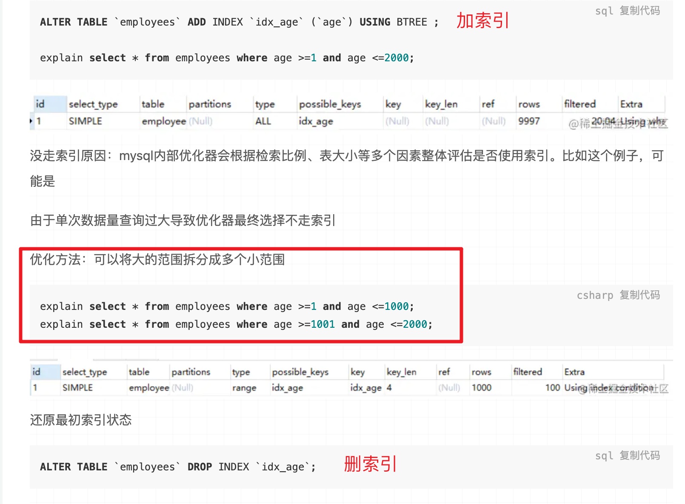

# 12. **索引使用总结**

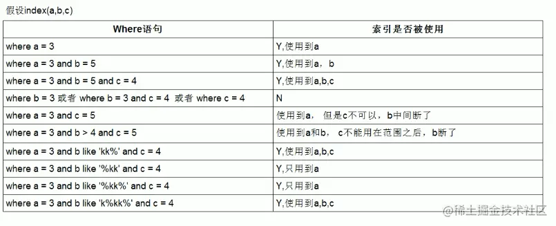

# EXPLAIN结果详解

[https://p9-juejin.byteimg.com/tos-cn-i-k3u1fbpfcp/823a2d668032453da6d5945943b83391~tplv-k3u1fbpfcp-zoom-in-crop-mark:4536:0:0:0.awebp?](https://p9-juejin.byteimg.com/tos-cn-i-k3u1fbpfcp/823a2d668032453da6d5945943b83391~tplv-k3u1fbpfcp-zoom-in-crop-mark:4536:0:0:0.awebp?)

### （1）id列

id列的编号是 select 的序列号，有几个 select 就有几个id，并且id的顺序是按 select 出现的顺序增长的。

id列越大执行优先级越高，id相同则从上往下执行，id为NULL最后执行。

### （2）select_type列

1）simple：简单查询。查询不包含子查询和union

2）primary：复杂查询中最外层的 select

3）subquery：包含在 select 中的子查询（不在 from 子句中）

4）derived：包含在 from 子句中的子查询。MySQL会将结果存放在一个临时表中，也称为派生表（derived的英文含义）

5）union：在 union 中的第二个和随后的 select

### （3）type列（最重要）

这一列表示关联类型或访问类型，即MySQL决定如何查找表中的行，查找数据行记录的大概范围。

依次从最优到最差分别为：**`system > const > eq_ref > ref > range > index > ALL`**

一般来说，得保证查询达到range级别，最好达到ref

### **NULL：**

mysql能够在优化阶段分解查询语句，在执行阶段用不着再访问表或索引。例如：在索引列中选取最小值，可以单独查找索引来完成，不需要在执行时访问表

### **const, system：**

mysql能对查询的某部分进行优化并将其转化成一个常量（可以看show warnings 的结果）。用于primary key 或 unique key 的所有列与常数比较时，所以表最多有一个匹配行，读取1次，速度比较快。system是const的特例，表里只有一条元组匹配时为system。

```

csharp复制代码
mysql> explain extended select * from (select * from film where id = 1) tmp;

```

[https://p1-juejin.byteimg.com/tos-cn-i-k3u1fbpfcp/60828c0bda4b45e8bcc60261299b18b4~tplv-k3u1fbpfcp-zoom-in-crop-mark:4536:0:0:0.awebp?](https://p1-juejin.byteimg.com/tos-cn-i-k3u1fbpfcp/60828c0bda4b45e8bcc60261299b18b4~tplv-k3u1fbpfcp-zoom-in-crop-mark:4536:0:0:0.awebp?)

### **eq_ref：**

primary key 或 unique key 索引的所有部分被连接使用 ，最多只会返回一条符合条件的记录。这可能是在const 之外最好的连接类型了，简单的 select 查询不会出现这种 type。

```

csharp复制代码
mysql> explain select * from film_actor left join film on film_actor.film_id = film.id;

```

[https://p1-juejin.byteimg.com/tos-cn-i-k3u1fbpfcp/284d65c07e1b4c55a18ee141d6bebfba~tplv-k3u1fbpfcp-zoom-in-crop-mark:4536:0:0:0.awebp?](https://p1-juejin.byteimg.com/tos-cn-i-k3u1fbpfcp/284d65c07e1b4c55a18ee141d6bebfba~tplv-k3u1fbpfcp-zoom-in-crop-mark:4536:0:0:0.awebp?)

### **ref：**

相比 eq_ref，不使用唯一索引，而是使用普通索引或者唯一性索引的部分前缀，索引要和某个值相比较，可能会找到多个符合条件的行。

```

csharp复制代码
mysql> explain select * from film where name = 'film1';

```

[https://p6-juejin.byteimg.com/tos-cn-i-k3u1fbpfcp/93a207794105461d80aa86c67b0aac99~tplv-k3u1fbpfcp-zoom-in-crop-mark:4536:0:0:0.awebp?](https://p6-juejin.byteimg.com/tos-cn-i-k3u1fbpfcp/93a207794105461d80aa86c67b0aac99~tplv-k3u1fbpfcp-zoom-in-crop-mark:4536:0:0:0.awebp?)

```

csharp复制代码
mysql> explain select film_id from film left join film_actor on film.id = film_actor.film_id;

```

[https://p1-juejin.byteimg.com/tos-cn-i-k3u1fbpfcp/78bff61425894dd6b7085cfa7a0fe547~tplv-k3u1fbpfcp-zoom-in-crop-mark:4536:0:0:0.awebp?](https://p1-juejin.byteimg.com/tos-cn-i-k3u1fbpfcp/78bff61425894dd6b7085cfa7a0fe547~tplv-k3u1fbpfcp-zoom-in-crop-mark:4536:0:0:0.awebp?)

### **range：**

范围扫描通常出现在 in(), between ,`>` ,`<`, `>=` 等操作中。使用一个索引来检索给定范围的行。

```

csharp复制代码
mysql> explain select * from actor where id > 1;

```

[https://p1-juejin.byteimg.com/tos-cn-i-k3u1fbpfcp/a5185a307df647fd914fc9e6c95b0d59~tplv-k3u1fbpfcp-zoom-in-crop-mark:4536:0:0:0.awebp?](https://p1-juejin.byteimg.com/tos-cn-i-k3u1fbpfcp/a5185a307df647fd914fc9e6c95b0d59~tplv-k3u1fbpfcp-zoom-in-crop-mark:4536:0:0:0.awebp?)

### **index：**

扫描全索引就能拿到结果，一般是扫描某个二级索引，这种扫描不会从索引树根节点开始快速查找，而是直接对二级索引的叶子节点遍历和扫描，速度还是比较慢的，这种查询一般为使用覆盖索引，二级索引一般比较小，所以这种通常比ALL快一些。

```

csharp复制代码
mysql> explain select * from film;

```

[https://p6-juejin.byteimg.com/tos-cn-i-k3u1fbpfcp/5f19262a27194b558279d783f90321f0~tplv-k3u1fbpfcp-zoom-in-crop-mark:4536:0:0:0.awebp?](https://p6-juejin.byteimg.com/tos-cn-i-k3u1fbpfcp/5f19262a27194b558279d783f90321f0~tplv-k3u1fbpfcp-zoom-in-crop-mark:4536:0:0:0.awebp?)

### **ALL：**

即全表扫描，扫描你的聚簇索引的所有叶子节点。通常情况下这需要增加索引来进行优化了。

```

csharp复制代码
mysql> explain select * from actor;

```

[https://p9-juejin.byteimg.com/tos-cn-i-k3u1fbpfcp/3b0ef840b2d0450c9c178966e8765c28~tplv-k3u1fbpfcp-zoom-in-crop-mark:4536:0:0:0.awebp?](https://p9-juejin.byteimg.com/tos-cn-i-k3u1fbpfcp/3b0ef840b2d0450c9c178966e8765c28~tplv-k3u1fbpfcp-zoom-in-crop-mark:4536:0:0:0.awebp?)

### （4）possible_keys列

这一列显示查询可能使用哪些索引来查找。

explain 时可能出现 possible_keys 有列，而 key 显示 NULL 的情况，这种情况是因为表中数据不多，mysql认为索引对此查询帮助不大，选择了全表查询。

如果该列是NULL，则没有相关的索引。在这种情况下，可以通过检查 where 子句看是否可以创造一个适当的索引来提高查询性能，然后用 explain 查看效果。

### （5）key列

这一列显示mysql实际采用哪个索引来优化对该表的访问。

如果没有使用索引，则该列是 NULL。如果想强制mysql使用或忽视possible_keys列中的索引，在查询中使用 force、index、ignore index。

### （6）key_len列

这一列显示了mysql在索引里使用的字节数，通过这个值可以算出具体使用了索引中的哪些列。

举例来说，film_actor的联合索引 idx_film_actor_id 由 film_id 和 actor_id 两个int列组成，并且每个int是4字节。通过结果中的key_len=4可推断出查询使用了第一个列：film_id列来执行索引查找。

```

csharp复制代码
explain select * from film_actor where film_id = 2;

```

[https://p9-juejin.byteimg.com/tos-cn-i-k3u1fbpfcp/46775005dd914fffa32c7a8975d9a912~tplv-k3u1fbpfcp-zoom-in-crop-mark:4536:0:0:0.awebp?](https://p9-juejin.byteimg.com/tos-cn-i-k3u1fbpfcp/46775005dd914fffa32c7a8975d9a912~tplv-k3u1fbpfcp-zoom-in-crop-mark:4536:0:0:0.awebp?)

### （8）ref列

这一列显示了在key列记录的索引中，表查找值所用到的列或常量，常见的有：const（常量），字段名（例：film.id）

### （9）rows列

这一列是mysql估计要读取并检测的行数，注意这个不是结果集里的行数。

作者：壹零壹大菠萝链接：https://juejin.cn/post/7195374929108762681来源：稀土掘金著作权归作者所有。商业转载请联系作者获得授权，非商业转载请注明出处。

### （10）explan的作用

MySQL中EXPLAIN语句用于分析查询语句的执行计划，它可以告诉你查询是如何执行的及每个步骤消耗的资源。在执行计划的输出结果中，EXPLAIN的extra列提供了有关查询的更多信息，例如使用了哪些索引、使用了哪些临时表等等。extra列的内容是根据执行计划的不同而不同的，有些常见的extra值包括：

- Using index：表示查询使用了覆盖索引，避免了回表操作；
- Using where：表示查询使用了WHERE子句；
- Using temporary：表示查询需要创建一个临时表来处理结果；
- Using filesort：表示查询需要执行一个外部排序，因为无法使用索引排序等。

总之，extra列提供了有关查询执行计划的更多信息，可以帮助你更好地理解查询的性能和优化查询语句。

参考：

[深入浅出Mysql（二）-Explain理解与索引最佳实战 - 掘金](https://juejin.cn/post/7195374929108762681#heading-33)
