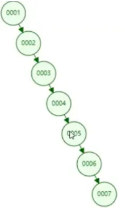
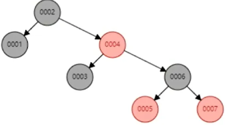
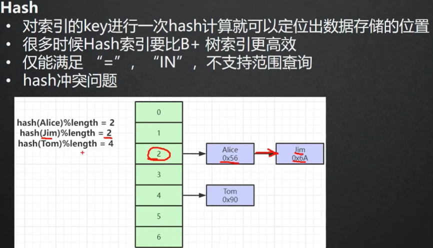
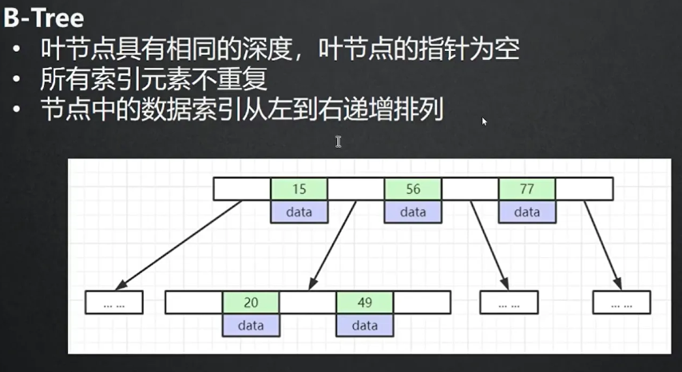
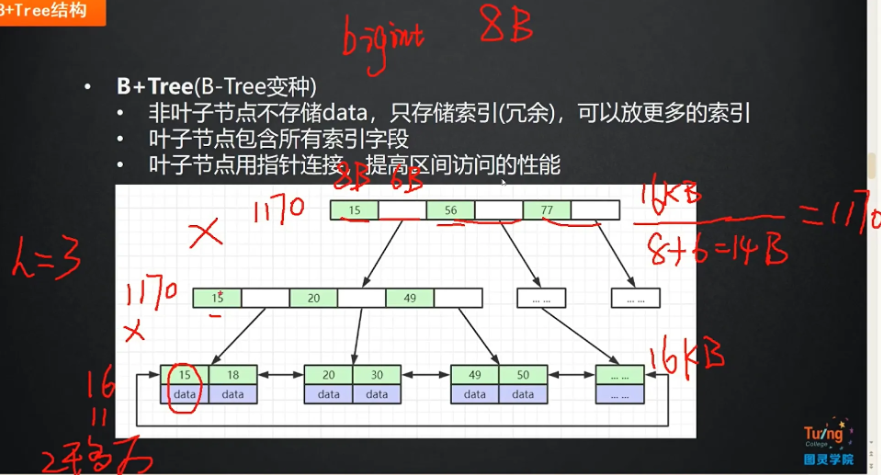
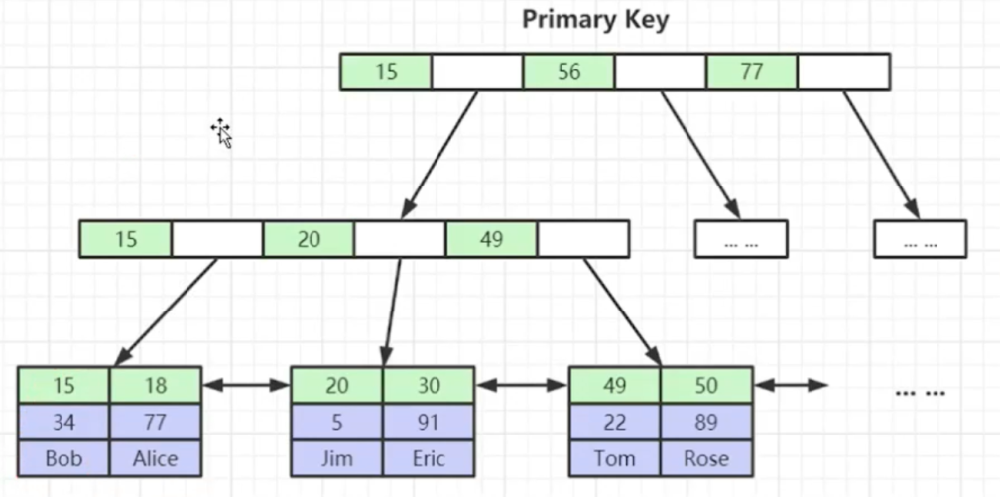
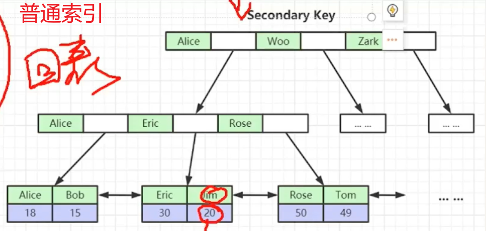
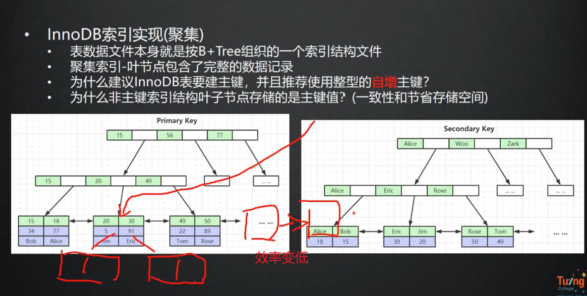
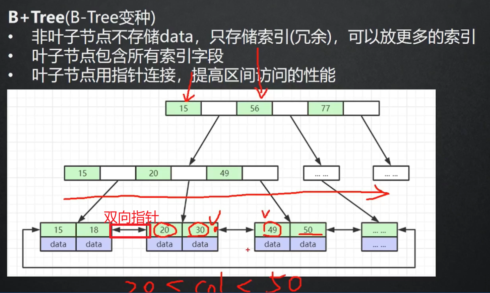
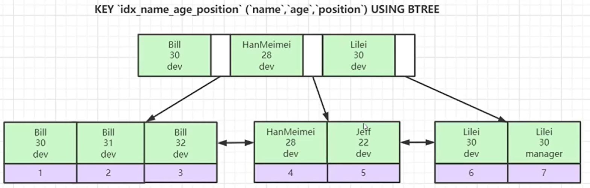

## 索引是什么

索引是帮助mysql高校获取数据的**排好序**的**数据结构**

[数据结构模拟网站](https://www.cs.usfca.edu/~galles/visualization/Algorithms.html)

索引的数据结构：

1. 二叉树
2. 红黑树（二叉平衡树）
3. hash表
4. b-tree

### 二叉树

### 红黑树
数据量大， 层级深，也是会io很多次

### hash

### b-tree

### b+tree


## myISAM 和innoDB

### myISAM（非聚簇索引）


frm 表结构， myd 数据， myi 索引
myisam  ， where col = 30 , 看col是不是索引列，如果是myi存物理地址，然后去myd文件夹里面找
### innoDB（聚簇索引）

frm 表结构  idb索引和数据
## 聚簇索引和非聚簇索引
聚集索引：索引和数据是一起存储的 比如innoDB存储引擎
主键索引通常是一个聚簇索引。因为主键是唯一的
### 聚簇索引（Clustered Index）
聚集索引：索引和数据是一起存储的 比如innoDB存储引擎
主键索引通常是一个聚簇索引。因为主键是唯一的



### 非聚簇索引（Non-Clustered Index）
非聚集索引：索引和数据分开存储， 需要回表查询数据的。 比如：myISAM引擎
- 非聚簇索引是指索引的逻辑顺序与数据的物理存储顺序不一致。索引中存储的是指向实际数据行的指针，而不是实际的数据行本身。
- **叶子节点中只存储了当前索引字段和主键ID，这样的存储结构就是非聚簇索引**。**普通索引**通常是非聚簇索引。


## innoDB索引实现（聚簇）



### 为什么要有主键

innoDB的表要有主键，主键（聚簇索引）来组织整张表的数据结构，没有主键用唯一索引，没有唯一索引用隐藏的rowid，能自己建主键就自己建，还能用rowid是隐藏的看不到的

### 为什么要是数字类型

1. 数字类型节约内存
2. 还有因为要更快的比大小

### 为什么要自增

1. 自增是为了更好的利用双向指针进行范围查找， （雪花算法是趋势递增）
2. 还有就是更快的插入，用自增是都是往索引数据结构的最后插入的，如果不是自增有可能需要插入到节点中间，会打乱之前的节点结构，数据节点分裂，导致插入行记录效率变低

## 联合索引

有多个字段组成的索引就是联合索引

```sql
select * from user where age = 18 and name = '张三';
```

如果我们在age和name字段上分别建两个索引，这个查询语句只会用到其中一个索引。

但是我们在age和name字段建一个联合索引（age，name），它的存储结构就变成这样了。

联合索引的优点：**大大减少扫描行数。**



## 最左匹配原则

最左匹配原则是指在建立联合索引的时候，遵循最左优先，以最左边的为起点任何连续的索引都能匹配上。

当我们在(age,name)上建立联合索引的时候，where条件中只有age可以用到索引，同时有age和name也可以用到索引。但是只有name的时候是无法用到索引的。

为什么会出现这种情况呢？

看上面的图，就理解了，(age,name)的联合索引，是先按照age排序，age相等的行再按照name排序。如果where条件只有一个name，当然无法用到索引。

## 覆盖索引


**叶子节点中只存储了当前索引字段（包括联合索引列）和主键ID，这样的存储结构就是非聚簇索引。**

当我们在age上建索引的时候，查询SQL是这样的时候：

```sql
select id from user where age = 18;
```

就会用到覆盖索引，**因为ID字段我们使用age索引的时候已经查出来，不需要再二次回表查询了。**

## 回表查询

**索引不能满足查询选择的列，走非聚簇索引，就会发生回表。回表次数越多，查询效率自然也就越慢。**

但是当查询SQL是这样的时候：

```sql
select * from user where age = 18;

```

想要查询所有字段，就需要二次回表查询。因为我们第一次用age索引的时候只查出来了主键ID，还需要再用主键ID回表查询出所有字段。

## 索引下推

索引下推（Index Condition Pushdown）是MySQL5.6引入的一个优化索引的特性。

在(age,name)上面建联合索引，并且查询SQL是这样的时候：

```sql
select * from user where age = 18 and name = '张三';
```


如果没有索引下推，会先匹配出 age = 18 的三条记录，再用ID回表查询，筛选出 name = '张三' 的记录。

如果使用索引下推，会先匹配出 age = 18 的三条记录，再筛选出 name = '张三' 的一条记录，最后再用ID回表查询。

由此得出，索引下推的优点：**减少了回表的扫描行数。**

## 实战：下面这个查询SQL该怎么建联合索引

```sql
select a from table where b = 1 and c = 2;

```

where条件有b和c的等值查询，联合索引就建成(b,c)，由于select后面有a，我们就建立 (b,c,a) 的联合索引，并且可以用到覆盖索引，查询速度更快。

[一篇文章讲清楚MySQL的聚簇/联合/覆盖索引、回表、索引下推 - 一灯架构 - 博客园](https://www.cnblogs.com/yidengjiagou/p/16410968.html)