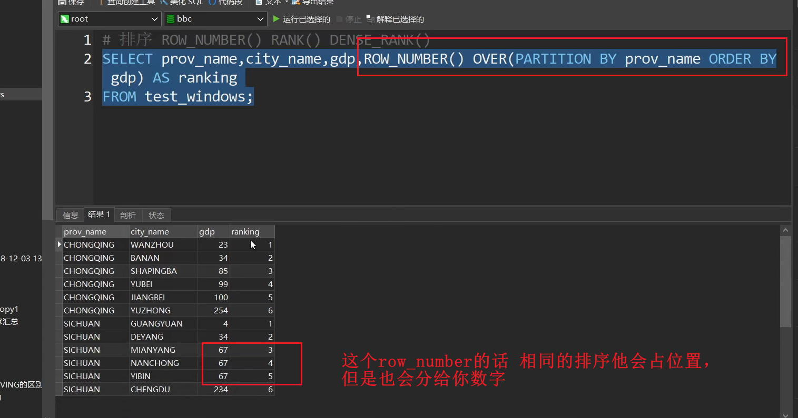
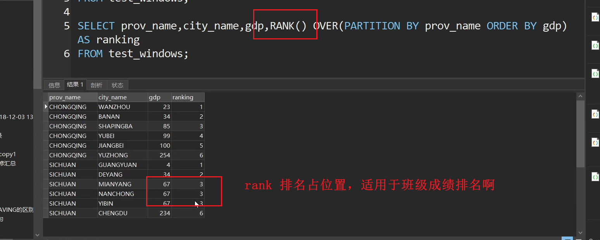
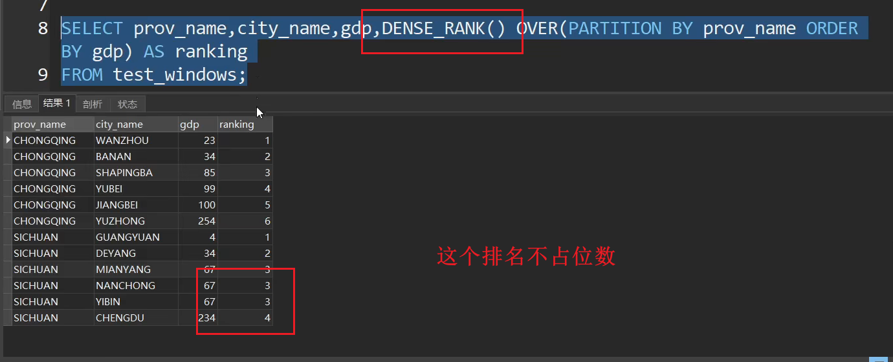
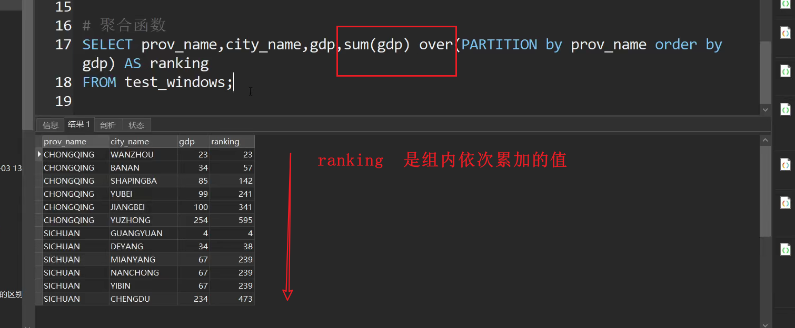
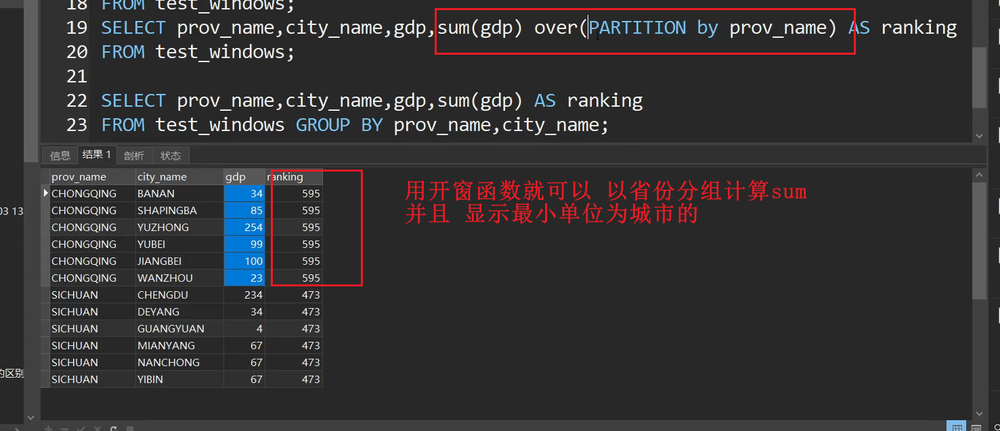
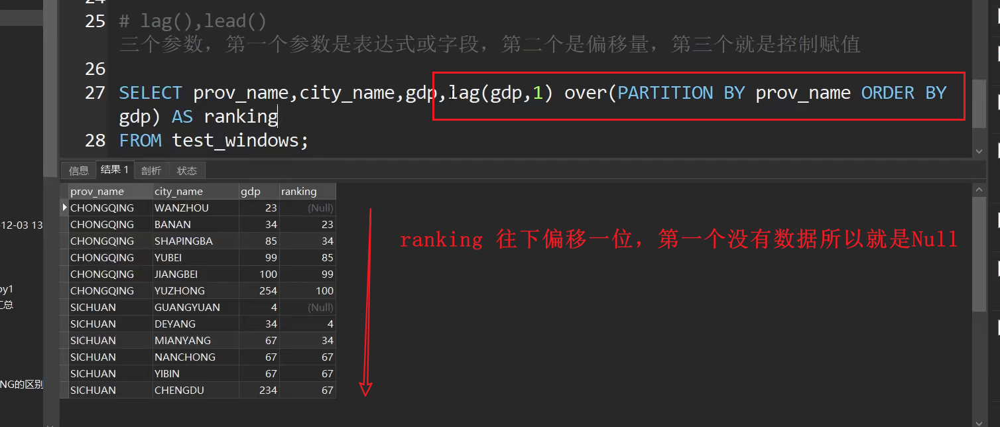
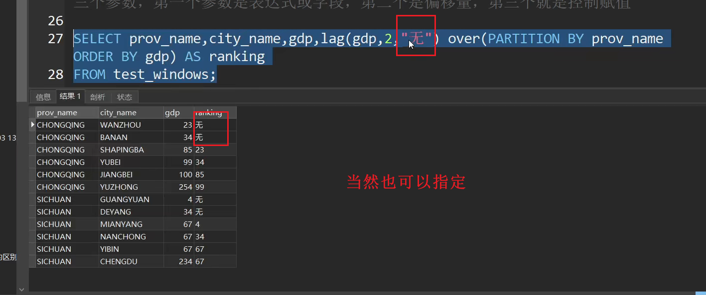
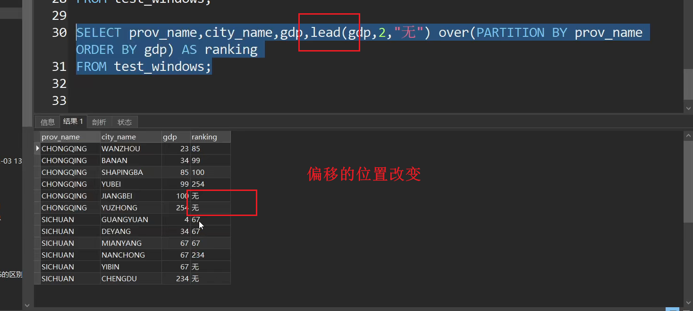

# 开窗函数的语法结构：

分析函数名() over(partition by 分组列名 order by 排序列名 rows between 开始位置 and 结束位置)
over()函数 中包括三个函数：包括分区partition by 列名、排序order by 列名、指定窗口范围rows between 开始位置 and 结束位置
rows between … and … 用得较少

# ROW_NUMBER()

# RANK()

# DENSE_REANK();

# 聚合函数 SUM（） PARTITION 的方式

## 用普通写法写的sum

改成开窗函数

---

---

# lag() lead()

[operateElement.ts](..%2F..%2F..%2F..%2F..%2F..%2FUsers%2Fitino%2Fdoc%2Fwechat%2FWeChat%20Files%2Fmo102217893%2FFileStorage%2FFile%2F2024-10%2FoperateElement.ts)

--- 

💡 这个实现很烂
参考过group写法：https://zhuanlan.zhihu.com/p/414683659

开窗函数group参考：https://blog.csdn.net/cqkxzyi/article/details/86301731

