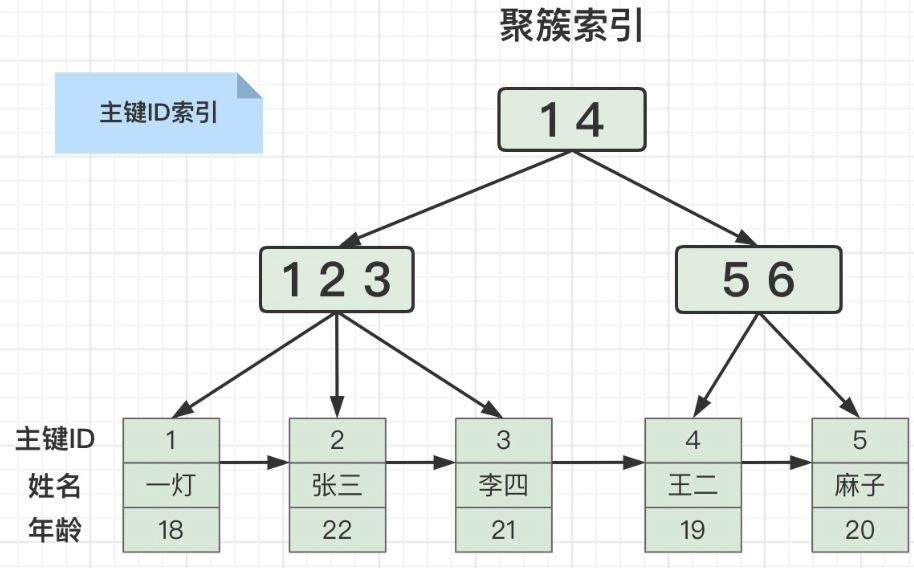
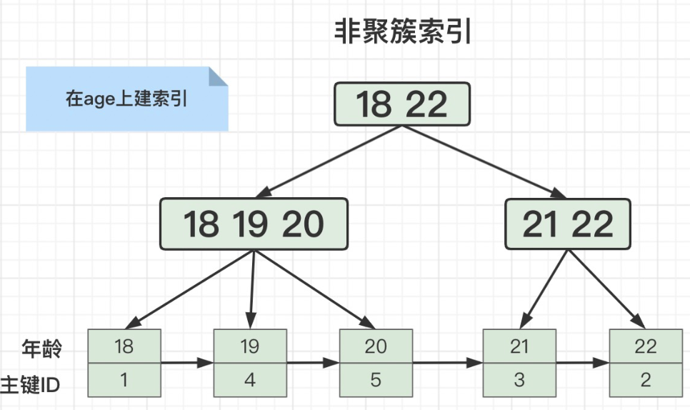
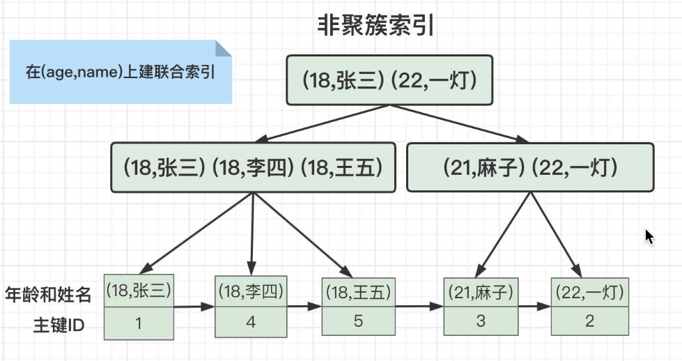

举个例子：有这么一张用户表
```
CREATE TABLE `user` (
  `id` int COMMENT '主键ID',
  `name` varchar(10) COMMENT '姓名',
  `age` int COMMENT '年龄',
  PRIMARY KEY (`id`)
) ENGINE=InnoDB CHARSET=utf8 COMMENT='用户表';

```

用户表中存储了这些数据：

| id | nane | age |
| --- | --- | --- |
| 1 | 一灯 | 18 |
| 2 | 张三 | 22 |
| 3 | 李四 | 21 |
| 4 | 王二 | 19 |
| 5 | 麻子 | 20 |

在MySQL中，索引是用于提高查询性能的关键工具。聚簇索引（Clustered Index）和非聚簇索引（Non-Clustered Index）是两种主要的索引类型，它们在数据存储和检索方式上有所不同。

### 聚簇索引（Clustered Index）

- 聚簇索引是指索引的逻辑顺序与数据的物理存储顺序一致。换句话说，聚簇索引将表的数据行按照索引的顺序直接存储在磁盘上。**叶子节点中存储了全部元素的索引，就是聚簇索引**。
- 在MySQL中，**主键索引通常是一个聚簇索引。因为主键是唯一的**，它确保了表中每一行都有一个唯一的标识符，这样就可以直接通过主键来定位数据行。
- 使用聚簇索引可以提高查询效率，因为相关数据通常存储在相邻的位置，减少了磁盘IO操作。



### 非聚簇索引（Non-Clustered Index）

- 非聚簇索引是指索引的逻辑顺序与数据的物理存储顺序不一致。索引中存储的是指向实际数据行的指针，而不是实际的数据行本身。
- **叶子节点中只存储了当前索引字段和主键ID，这样的存储结构就是非聚簇索引**。**普通索引**（非主键索引）通常是非聚簇索引。当你创建一个普通索引时，MySQL会在索引中存储指向实际数据行的引用。
- 非聚簇索引可以提高查询效率，但相比于聚簇索引，它需要额外的IO操作来定位实际的数据行



## 联合索引

有多个字段组成的索引就是联合索引

```sql
select * from user where age = 18 and name = '张三';
```

如果我们在age和name字段上分别建两个索引，这个查询语句只会用到其中一个索引。

但是我们在age和name字段建一个联合索引（age，name），它的存储结构就变成这样了。

联合索引的优点：**大大减少扫描行数。**



## 最左匹配原则

最左匹配原则是指在建立联合索引的时候，遵循最左优先，以最左边的为起点任何连续的索引都能匹配上。

当我们在(age,name)上建立联合索引的时候，where条件中只有age可以用到索引，同时有age和name也可以用到索引。但是只有name的时候是无法用到索引的。

为什么会出现这种情况呢？

看上面的图，就理解了，(age,name)的联合索引，是先按照age排序，age相等的行再按照name排序。如果where条件只有一个name，当然无法用到索引。

## 覆盖索引


**叶子节点中只存储了当前索引字段（包括联合索引列）和主键ID，这样的存储结构就是非聚簇索引。**

当我们在age上建索引的时候，查询SQL是这样的时候：

```sql
select id from user where age = 18;
```

就会用到覆盖索引，**因为ID字段我们使用age索引的时候已经查出来，不需要再二次回表查询了。**

## 回表查询

**索引不能满足查询选择的列，走非聚簇索引，就会发生回表。回表次数越多，查询效率自然也就越慢。**

但是当查询SQL是这样的时候：

```sql
select * from user where age = 18;

```

想要查询所有字段，就需要二次回表查询。因为我们第一次用age索引的时候只查出来了主键ID，还需要再用主键ID回表查询出所有字段。

## 索引下推

索引下推（Index Condition Pushdown）是MySQL5.6引入的一个优化索引的特性。

在(age,name)上面建联合索引，并且查询SQL是这样的时候：

```sql
select * from user where age = 18 and name = '张三';
```


如果没有索引下推，会先匹配出 age = 18 的三条记录，再用ID回表查询，筛选出 name = '张三' 的记录。

如果使用索引下推，会先匹配出 age = 18 的三条记录，再筛选出 name = '张三' 的一条记录，最后再用ID回表查询。

由此得出，索引下推的优点：**减少了回表的扫描行数。**

## 实战：下面这个查询SQL该怎么建联合索引

```sql
select a from table where b = 1 and c = 2;

```

where条件有b和c的等值查询，联合索引就建成(b,c)，由于select后面有a，我们就建立 (b,c,a) 的联合索引，并且可以用到覆盖索引，查询速度更快。

[一篇文章讲清楚MySQL的聚簇/联合/覆盖索引、回表、索引下推 - 一灯架构 - 博客园](https://www.cnblogs.com/yidengjiagou/p/16410968.html)